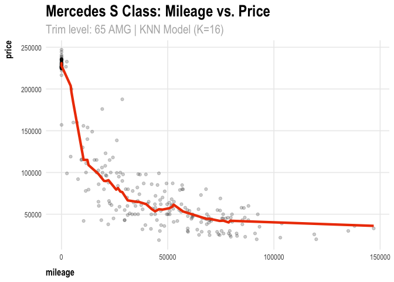

Homework 1
================
Alice Kemp

## **1) Data visualization: Flights at ABIA**

<!-- -->

## **2) Wrangling the Billboard Top 100**

The weekly Billboard Top 100 list has tracked the most popular songs and
artists in the U.S. since 1958, compiling data points from radio
airplays, audio sales, and streaming activity.  
### **Part A**

|     |               **Performer**               |               **Song**                | **Count (weeks)** |
|-----|:-----------------------------------------:|:-------------------------------------:|:-----------------:|
| 1   |              Imagine Dragons              |             “Radioactive”             |        87         |
| 2   |                AWOLNATION                 |                “Sail”                 |        79         |
| 3   |                Jason Mraz                 |              “I’m Yours”              |        76         |
| 4   |                The Weeknd                 |           “Blinding Lights”           |        76         |
| 5   |                LeAnn Rimes                |            “How Do I Live”            |        69         |
| 6   | LMFAO Featuring Lauren Bennett & GoonRock |          “Party Rock Anthem”          |        68         |
| 7   |                OneRepublic                |           “Counting Stars”            |        68         |
| 8   |                   Adele                   |         “Rolling In The Deep”         |        65         |
| 9   |                   Jewel                   | “Foolish Games/You Were Meant For Me” |        65         |
| 10  |             Carrie Underwood              |          “Before He Cheats”           |        64         |
|     |                                           |                                       |                   |

*Caption:* Imagine Dragons’ “Radioactive” is the most popular song with
87 total appearances on the Billboard Top 100 since its release in 2012,
followed by AWOLNATION’s 2011 hit “Sail” with a total of 79 weekly
appearances. Jason Mraz’s “I’m Yours”, released in 2008, and The
Weeknd’s “Blinding Lights, recently released in 2020, tied for third
place with 76 weekly appearances each.

### **Part B**

Th musical diversity of the Billboard 100 has increased over the few
last decades, last peaking in 1966 when 832 unique songs appeared on the
list. Diversity then dropped into the early 2000’s before rising again
to reach 804 distinct appearances on the Billboard 100 in 2020.  
<!-- -->

### **Part C**

There have been 19 artists who have had at least 30 songs appear on the
Billboard Top 100 more than ten times since 1958. As of 2021, leading
the lineup is Elton John with 52 songs followed by Madonna with 44 and
Kenny Chesney with 42.
<!-- -->

## **3) Wrangling the Olympics**

### **Part A**

The 95th percentile of female Olympic medalists in the top 20 sports
between 1924 and 2016 is 186 cm.

|                    | **95th Percentile** |
|--------------------|---------------------|
| Female Height (cm) | 186.0               |

### **Part B**

The greatest variation in female medalists’ height occurs in Women’s
Coxed Fours Rowing, where the average height is 173.3 cm with a standard
deviation of 10.9 cm. Overall, Coxed Rowing events account for three out
of the top five for most varied height distributions - this is due to
the historically dramatic difference in optimal heights for crew rowers
versus coxswains.

|                                       | **Average Height (cm)** | **Standard Deviation (cm)** |
|---------------------------------------|:-----------------------:|:---------------------------:|
| Rowing Women’s Coxed Fours            |          173.3          |            10.9             |
| Women’s Basketball                    |          183.0          |             9.7             |
| Rowing Women’s Coxed Quadruple Sculls |          171.9          |             9.2             |
| Rowing Women’s Coxed Eights           |          178.2          |             8.7             |
| Swimming Women’s 100 metres Butterfly |          173.2          |             8.1             |

### **Part C**

Looking at the average ages of Olympic swimmers over time, we observe
that overall average age peaked in 1920 before falling until the 1976
Olympics. Since 1976, average age has steadily grown to reach 23.2 in
2016.

| **Year** | **Average Age** | **Difference** |
|:--------:|:---------------:|:--------------:|
|   1900   |      18.0       |       \-       |
|   1904   |      20.1       |      +2.1      |
|   1908   |      22.0       |      +0.9      |
|   1912   |      23.5       |      +1.5      |
|   1920   |      26.0       |      +2.5      |
|   1924   |      23.6       |      -2.4      |
|   1928   |      23.5       |      -0.1      |
|   1932   |      19.0       |      -4.5      |
|   1936   |      21.0       |      +2.0      |
|   1948   |      20.0       |      -1.0      |
|   1952   |      20.1       |      +0.1      |
|   1956   |      18.9       |      -1.2      |
|   1960   |      18.6       |      -0.3      |
|   1964   |      19.4       |      +0.8      |
|   1968   |      19.2       |      -0.2      |
|   1972   |      19.0       |      -0.2      |
|   1976   |      18.5       |      -0.5      |
|   1980   |      18.8       |      +0.3      |
|   1984   |      19.8       |      +1.0      |
|   1988   |      20.6       |      +0.8      |
|   1992   |      21.0       |      +0.4      |
|   1996   |      22.0       |      +1.0      |
|   2000   |      22.5       |      +0.5      |
|   2004   |      22.4       |      -0.1      |
|   2008   |      22.9       |      +0.5      |
|   2012   |      23.3       |      +0.4      |
|   2016   |      23.2       |      -0.1      |

<!-- -->

## **4) K-nearest neighbors**

The 350 trim level yields a higher optimal value of k, equal to 32. This
may be due to the fact that there is less variance in the data for 350
trim models than for 65 AMG models. Thus, the 350 KNN model can optimize
with a higher value of k (more neighbors, but lower sd) to minimize
error as compared to the KNN model for the 65 AMG cars.  
<!-- --><!-- --><!-- -->
