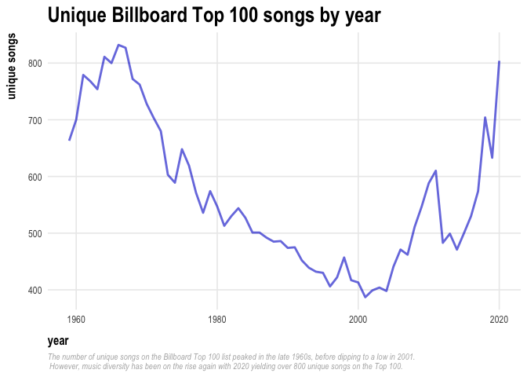
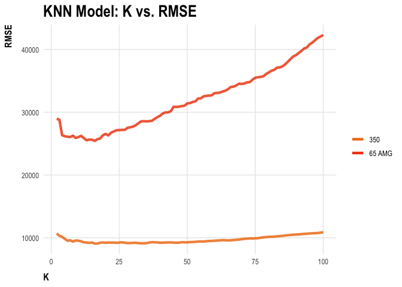
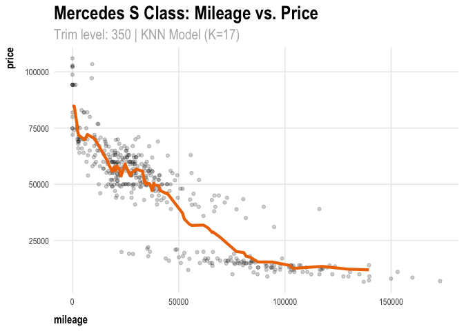

Homework-1
================
Alice Kemp

## **1) Data visualization: flights at ABIA**

<!-- -->

## **2) Wrangling the Billboard Top 100**

### **Part A: Ten most popular songs since 1958**

    ##     n                                 performer
    ## 1   1                           Imagine Dragons
    ## 2   2                                AWOLNATION
    ## 3   3                                Jason Mraz
    ## 4   4                                The Weeknd
    ## 5   5                               LeAnn Rimes
    ## 6   6 LMFAO Featuring Lauren Bennett & GoonRock
    ## 7   7                               OneRepublic
    ## 8   8                                     Adele
    ## 9   9                                     Jewel
    ## 10 10                          Carrie Underwood
    ##                                   song count
    ## 1                          Radioactive    87
    ## 2                                 Sail    79
    ## 3                            I'm Yours    76
    ## 4                      Blinding Lights    76
    ## 5                        How Do I Live    69
    ## 6                    Party Rock Anthem    68
    ## 7                       Counting Stars    68
    ## 8                  Rolling In The Deep    65
    ## 9  Foolish Games/You Were Meant For Me    65
    ## 10                    Before He Cheats    64

### **Part B: Musical diversity of Top 100 over time**

<!-- -->

### **Part C: Artists with ten-week hits**

<!-- -->

## **3) Wrangling the Olympics**

### **Part A**

The 95th percentile of female Olympic medalists in the top 20 sports
between 1924 and 2016 is 186 cm. \| \| **95th Percentile** \| \|——————–
\|——————— \| \| Female Height (cm) \| 186.0 \|

### **Part B**

The greatest variation in female medalists’ height occurs in Women’s
Coxed Fours Rowing, where the average height is 173.3 cm with a standard
deviation of 10.9 cm. Overall, Coxed Rowing events account for three out
of the top five for most varied height distributions - this is due to
the historically dramatic difference in optimal heights for crew rowers
versus coxswains.

|                                       | **Average Height (cm)** | **Standard Deviation (cm)** |
|---------------------------------------|:-----------------------:|:---------------------------:|
| Rowing Women’s Coxed Fours            |          173.3          |            10.9             |
| Women’s Basketball                    |          183.0          |             9.7             |
| Rowing Women’s Coxed Quadruple Sculls |          171.9          |             9.2             |
| Rowing Women’s Coxed Eights           |          178.2          |             8.7             |
| Swimming Women’s 100 metres Butterfly |          173.2          |             8.1             |

    ## # A tibble: 5 × 3
    ##   event                                   avg    sd
    ##   <chr>                                 <dbl> <dbl>
    ## 1 Rowing Women's Coxed Fours             173. 10.9 
    ## 2 Basketball Women's Basketball          183.  9.70
    ## 3 Rowing Women's Coxed Quadruple Sculls  172.  9.25
    ## 4 Rowing Women's Coxed Eights            178.  8.74
    ## 5 Swimming Women's 100 metres Butterfly  173.  8.13

### **Part C**

    ##    year avg_age
    ## 1  1900    18.0
    ## 2  1904    20.1
    ## 3  1906    22.0
    ## 4  1908    23.5
    ## 5  1912    27.0
    ## 6  1920    26.0
    ## 7  1924    23.6
    ## 8  1928    23.5
    ## 9  1932    19.0
    ## 10 1936    21.0
    ## 11 1948    20.0
    ## 12 1952    20.1
    ## 13 1956    18.9
    ## 14 1960    18.6
    ## 15 1964    19.4
    ## 16 1968    19.2
    ## 17 1972    19.0
    ## 18 1976    18.5
    ## 19 1980    18.8
    ## 20 1984    19.8
    ## 21 1988    20.6
    ## 22 1992    21.0
    ## 23 1996    22.0
    ## 24 2000    22.5
    ## 25 2004    22.4
    ## 26 2008    22.9
    ## 27 2012    23.3
    ## 28 2016    23.2

<!-- -->

## **4) K-nearest neighbors**

The 350 trim level yields a higher optimal value of k, equal to 32. This
may be due to the fact that there is less variance in the data for 350
trim models than for 65 AMG models. Thus, the 350 KNN model can optimize
with a higher value of k (more neighbors, but lower sd) to minimize
error as compared to the KNN model for the 65 AMG cars.

``` r
# Trim level: 350 
sclass = read.csv("/Users/alicekemp/statistical-learning/stat-learning/Homework-1/data/sclass.csv") %>%
  select(trim, mileage, price) %>%
  filter(trim %in% c(350,"65 AMG"))

sclass350 = sclass %>%
  filter(trim==350)
attach(sclass)

# create train/test splits
sclass350_split = initial_split(sclass350, prop = 0.8)
sclass350_train = training(sclass350_split)
sclass350_test = testing(sclass350_split)

# KNN models
rmse_out350 = foreach(i=2:100, .combine='c') %do% {
  # train the model and calculate RMSE on the test set
  knn_model = knnreg(price ~ mileage, data=sclass350_train, k = i)
  modelr::rmse(knn_model, sclass350_test)
} 
##### 
# repeat for 65 AMG trim level 
#####
sclass65 = sclass %>%
  filter(trim=="65 AMG")

sclass65_split = initial_split(sclass65, prop = 0.8)
sclass65_train = training(sclass65_split)
sclass65_test = testing(sclass65_split)

rmse_out65 = foreach(i=2:100, .combine='c') %do% {
  knn_model = knnreg(price ~ mileage, data=sclass65_train, k = i)
  modelr::rmse(knn_model, sclass65_test)} 

# plot K vs. RMSE for both trim levels
k_vals = seq(2,100,1)
df = data.frame(k_vals, rmse_out350, rmse_out65) 
ggplot(df) + 
  geom_line(aes(x = k_vals, y = rmse_out350, color = "350"), size = 1.5, alpha = 0.8) + 
  geom_line(aes(x = k_vals, y = rmse_out65, color = "65 AMG"), size = 1.5, alpha = 0.8) + 
  scale_color_manual("",
                     breaks = c("350", "65 AMG"),
                     values = c("darkorange2","violetred2")) + 
  my_theme + 
  xlab("K") + 
  ylab("RMSE") + 
  labs(title = "KNN Model: K vs. RMSE") 
```

<!-- -->

``` r
#####
# Trim level: 350
#####

# find optimal K (minimum RMSE)
optimal_k = df %>%
  select(k_vals, rmse_out350) %>%
  arrange(rmse_out350)

# attach predictions to the test df
knn32 = knnreg(price ~ mileage, data=sclass350_train, k = 32)

sclass350_test = sclass350_test %>%
  mutate(price_pred = predict(knn32, sclass350_test))

# plot data and KNN model fit 
ggplot(data = sclass350_test) + 
  geom_point(mapping = aes(x =  mileage, y = price), alpha=0.2) + 
  geom_line(aes(x = mileage, y = price_pred), color='darkorange2', size=1.5) +
  my_theme + 
  labs(
    title = "Mercedes S Class: Mileage vs. Price",
    subtitle = "Trim level: 350 | KNN Model (K=32)")
```

<!-- -->

``` r
#####
# Trim level: 65 AMG
#####
# find optimal K (minimum RMSE) 
optimal_k = df %>%
  group_by(k_vals) %>%
  arrange(rmse_out65) %>%
  top_n(1)
# attach predictions to the test df
knn10 = knnreg(price ~ mileage, data=sclass65_train, k = 10)

sclass65_test = sclass65_test %>%
  mutate(price_pred = predict(knn10, sclass65_test))

ggplot(data = sclass65_test) + 
  geom_point(mapping = aes(x =  mileage, y = price), alpha=0.2) + 
  geom_line(aes(x = mileage, y = price_pred), color='violetred2', size=1.5) +
  my_theme + 
  labs(
    title = "Mercedes S Class: Mileage vs. Price",
    subtitle = "Trim level: 65 AMG | KNN Model (K=10)") 
```

<!-- -->
