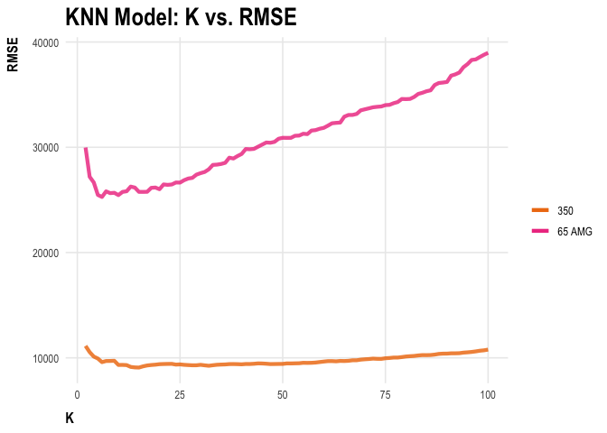
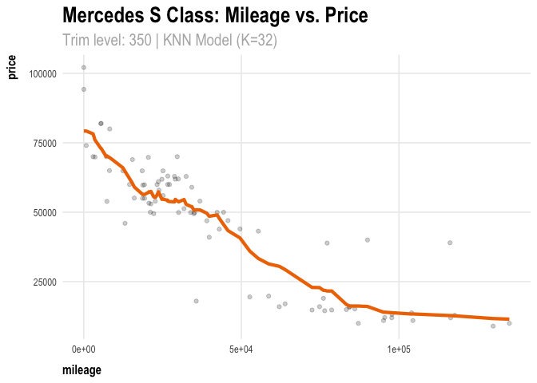
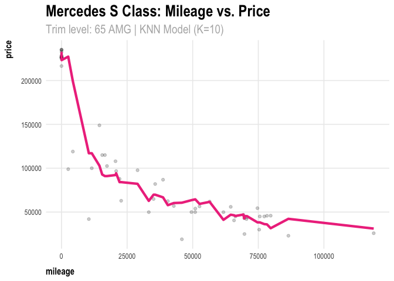

## **4) K-nearest neighbors**

    ######################################################## 
    # Trim: 350 
    ########################################################  
    sclass = read.csv("/Users/alicekemp/statistical-learning/stat-learning/Homework-1/data/sclass.csv") %>%
      select(trim, mileage, price) %>%
      filter(trim %in% c(350,"65 AMG")) %>%
      write_csv(here("data/sclass_clean.csv")) 

    sclass350 = sclass %>%
      filter(trim==350)

    # create train/test splits
    sclass350_split = initial_split(sclass350, prop = 0.8)
    sclass350_train = training(sclass350_split)
    sclass350_test = testing(sclass350_split)

    # KNN models
    rmse_out = foreach(i=2:100, .combine='c') %do% {
      # train the model and calculate RMSE on the test set
      knn_model = knnreg(price ~ mileage, data=sclass350_train, k = i)
      modelr::rmse(knn_model, sclass350_test)
    } 

    # plot K vs. RMSE
    k_vals = seq(2,100,1)
    df = data.frame(k_vals, rmse_out)
    kplot350 = ggplot(df) + 
      geom_line(aes(x = k_vals, y = rmse_out), color = "steelblue3") + 
      xlab("K") + 
      labs(title = "K-Fold Cross Validation: K vs. RMSE") 

    # find optimal K (minimum RMSE) = 32
    optimal_k = df %>%
      group_by(k_vals) %>%
      arrange(rmse_out)

    # attach predictions to the test df
    knn32 = knnreg(price ~ mileage, data=sclass350_train, k = 32)

    sclass350_test = sclass350_test %>%
      mutate(price_pred = predict(knn32, sclass350_test))

    # plot data and KNN model fit 
    ggplot(data = sclass350_test) + 
      geom_point(mapping = aes(x =  mileage, y = price), alpha=0.2) + 
      geom_line(aes(x = mileage, y = price_pred), color='steelblue3', size=1.5) +
      labs(
        title = "Mercedes S Class: Mileage vs. Price",
        subtitle = "Trim level: 350 | KNN Model (K=32)")

    ######################################################## 
    # Trim: 65 AMG
    ######################################################## 

    sclass65 = sclass %>%
      filter(trim=="65 AMG")

    # create train/test splits
    sclass65_split = initial_split(sclass65, prop = 0.8)
    sclass65_train = training(sclass65_split)
    sclass65_test = testing(sclass65_split)

    # KNN models
    rmse_out = foreach(i=2:100, .combine='c') %do% {
      # train the model and calculate RMSE on the test set
      knn_model = knnreg(price ~ mileage, data=sclass65_train, k = i)
      modelr::rmse(knn_model, sclass65_test)
    } 

    # plot K vs. RMSE
    k_vals = seq(2,100,1)
    df = data.frame(k_vals, rmse_out)
    ggplot(df) + 
      geom_line(aes(x = k_vals, y = rmse_out), color = "steelblue3") + 
      xlab("K") + 
      labs(title = "K-Fold Cross Validation: K vs. RMSE") 

    # find optimal K (minimum RMSE) = 10
    optimal_k = df %>%
      group_by(k_vals) %>%
      arrange(rmse_out)

    # attach predictions to the test df
    knn10 = knnreg(price ~ mileage, data=sclass65_train, k = 10)

    sclass65_test = sclass65_test %>%
      mutate(price_pred = predict(knn10, sclass65_test))

    ggplot(data = sclass65_test) + 
      geom_point(mapping = aes(x =  mileage, y = price), alpha=0.2) + 
      geom_line(aes(x = mileage, y = price_pred), color='steelblue3', size=1.5) +
      labs(
        title = "Mercedes S Class: Mileage vs. Price",
        subtitle = "Trim level: 65 AMG | KNN Model (K=10)"
      )

