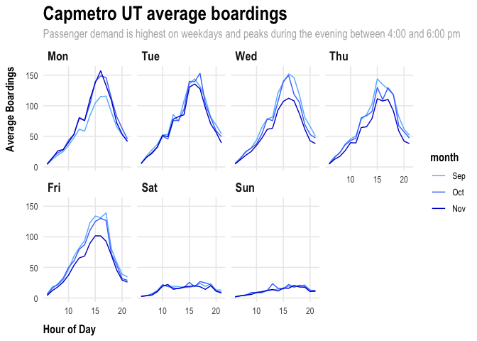

# Problem 1: Capmetro UT Visualization

# Problem 2: Saratoga house prices

## Data

The dataset used in this report covers housing prices and 15
characteristics for over 1,700 houses in the Saratoga County, Florida
residential market in the year 2006. Characteristics include lot size,
age, land value, living area, percent of neighborhood that graduated
college, bedrooms, fireplaces, bathrooms, rooms, type of heating, type
of fuel used for heating, type of sewer system, and whether the property
was waterfront, new construction, and had central air conditioning. To
better compare performance across models, the categorical variables were
converted to binary dummy variables. The data was then normalized in
order to build the K-nearest neighbors model.

    ##                 rmse
    ## rmse_med   0.7036676
    ## rmse_big   0.6489058
    ## rmse_lasso 0.5537551
    ## rmse_knn   0.6448680

## Methodology

To analyze the effects of house features on a home’s sale price, four
models of varying complexity were created. The first two baseline models
utilized simple linear OLS regressions of price on a selection of home
features, with the “big” OLS model including interaction effects of all
included features. The data was also randomized into train/test splits
with an 80% training proportion to build and evaluate model performance.
The next model utilized a LASSO model for feature selection. All
features and their interactions were included, and k-fold cross
validation (K = 10) was performed to minimize the risk of overfitting
the sample data. Finally, a K-nearest neighbors model was run and
iterated over 100 values of K to identify the final model. This KNN
model also iterated over K-10 folds for cross validation purposes.

## Technical Notes

To compare out-of-sample performance across models, the RMSE was
calculated for each regression for the test set and an average RMSE was
calculated as the mean out-of-sample RMSE across folds for the
cross-validated LASSO and KNN models. For the two baseline OLS models,
the big model which included most interaction terms performed better
than the medium model with an out-of-sample RMSE of approximately 0.649
compared to 0.704. The cross-validated LASSO regression outperformed all
other models, yielding an out-of-sample RMSE of approximately 0.554. In
the LASSO model, coefficient shrinkage was performed on all possible
interactions of all factor levels and features, while the KNN model
utilized group patterns in the training data to classify the test data.

## Conclusion

Overall, the cross-validated LASSO model performed the best out of the
four regressions, with normalized out-of-sample error of about 0.55. To
best predict housing prices based on the variables included in this
study, we recommend using the LASSO model. This model not only has a
lower error than the other models, but also identifies the most
important features and interactions that impact property prices. The
features identified in this model are lot size, land value, living area,
number of bathrooms, waterfront property, and central air systems. The
most important interactions include septic sewer systems based on
property age, land value based on new construction status, and living
area based on central air status.

# Problem 3: Classification and retrospective sampling

## Data

This analysis investigates credit default history of 1,000 customers of
a German bank. The data was sampled retrospectively, with the relatively
small sample of defaulted loans matched with a similar set of loans that
did not default. This sampling resulted in an outsized representation of
defaults relative to a random sample of the bank’s population of loans.
Variables of interest studied in this analysis include loan duration,
loan amount, installment amount, consumer age, consumer credit history,
loan purpose, and a dummy variable for foreign workers. In this
analysis, we attempt to predict a consumer’s probability of default
based on features deemed statistically significant.

    ## 
    ## Call:
    ## glm(formula = Default ~ duration + amount + installment + age + 
    ##     history + purpose + foreign, family = binomial(link = "logit"), 
    ##     data = german_credit)
    ## 
    ## Deviance Residuals: 
    ##     Min       1Q   Median       3Q      Max  
    ## -2.3464  -0.8050  -0.5751   1.0250   2.4767  
    ## 
    ## Coefficients:
    ##                       Estimate Std. Error z value Pr(>|z|)    
    ## (Intercept)         -7.075e-01  4.726e-01  -1.497  0.13435    
    ## duration             2.526e-02  8.100e-03   3.118  0.00182 ** 
    ## amount               9.596e-05  3.650e-05   2.629  0.00856 ** 
    ## installment          2.216e-01  7.626e-02   2.906  0.00366 ** 
    ## age                 -2.018e-02  7.224e-03  -2.794  0.00521 ** 
    ## historypoor         -1.108e+00  2.473e-01  -4.479 7.51e-06 ***
    ## historyterrible     -1.885e+00  2.822e-01  -6.679 2.41e-11 ***
    ## purposeedu           7.248e-01  3.707e-01   1.955  0.05058 .  
    ## purposegoods/repair  1.049e-01  2.573e-01   0.408  0.68346    
    ## purposenewcar        8.545e-01  2.773e-01   3.081  0.00206 ** 
    ## purposeusedcar      -7.959e-01  3.598e-01  -2.212  0.02694 *  
    ## foreigngerman       -1.265e+00  5.773e-01  -2.191  0.02849 *  
    ## ---
    ## Signif. codes:  0 '***' 0.001 '**' 0.01 '*' 0.05 '.' 0.1 ' ' 1
    ## 
    ## (Dispersion parameter for binomial family taken to be 1)
    ## 
    ##     Null deviance: 1221.7  on 999  degrees of freedom
    ## Residual deviance: 1070.0  on 988  degrees of freedom
    ## AIC: 1094
    ## 
    ## Number of Fisher Scoring iterations: 4

## Methodology

The data was grouped by credit history, with three bins diving consumers
by “terrible”, “poor”, and “good” prior credit history. Then,
probability of default was calculated for each group by summing the
number of defaulted loans and dividing by the number of consumers per
credit group. From the figure shown, we observe that individuals with
good credit history have a high probability of defaulting on a loan at
approximately 60%, compared to 32% for consumers with “poor” credit and
18% for “terrible” credit history.

## Evaluation

Looking at the above probabilities, it is clear that the method of
retrospective sampling may have introduced some bias in the data
analyzed in this report. Upon closer investigation, we find that
consumers with “good” credit account for only 9% of the individuals
included in the study, while those with “poor” and “terrible” credit
make up 62% and 29%, respectively. Therefore, we observe evidence of
sampling selection bias in the data points included in this analysis,
with a potentially unrepresentative sample fo defaults from “good”
credit individuals than would appear in a random sample. To improve this
analysis’ predictive power in predicting a bank customer’s probability
of default, we recommend resampling the data to include a balanced panel
of individuals across credit histories, or a larger random sample of
loans irrespective of default status to gather data that is more
representative of the population.

# Problem 4: Children and hotel reservations

## Data

The data in this analysis includes 45,000 data points from reservations
at a major U.S.-based hotel chain. The variable of interest that we are
attempting to predict is whether or not a particular booking includes
children, based on 21 features including hotel type, meal type, customer
demographics, number of adults, repeated guests, and other reservation
attributes.

    ##            rmse
    ## ols1  3.1072638
    ## ols2  4.1012957
    ## lasso 0.2267663

    ## Naive Bayes 
    ## 
    ## 4999 samples
    ##    4 predictor
    ##    2 classes: '0', '1' 
    ## 
    ## No pre-processing
    ## Resampling: Cross-Validated (20 fold) 
    ## Summary of sample sizes: 4750, 4748, 4749, 4749, 4749, 4749, ... 
    ## Resampling results across tuning parameters:
    ## 
    ##   usekernel  Accuracy   Kappa     
    ##   FALSE      0.5141140  0.07002745
    ##    TRUE      0.9195853  0.00000000
    ## 
    ## Tuning parameter 'laplace' was held constant at a value of 0
    ## Tuning
    ##  parameter 'adjust' was held constant at a value of 1
    ## Accuracy was used to select the optimal model using the largest value.
    ## The final values used for the model were laplace = 0, usekernel = TRUE
    ##  and adjust = 1.

    ##       Fold  Accuracy
    ## 1   Fold01 0.7228916
    ## 2   Fold02 0.7250996
    ## 3   Fold03 0.6920000
    ## 4   Fold04 0.7080000
    ## 5   Fold05 0.7080000
    ## 6   Fold06 0.7080000
    ## 7   Fold07 0.7320000
    ## 8   Fold08 0.6852590
    ## 9   Fold09 0.7660000
    ## 10  Fold10 0.7329317
    ## 11  Fold11 0.7460000
    ## 12  Fold12 0.6960000
    ## 13  Fold13 0.7080000
    ## 14  Fold14 0.7720000
    ## 15  Fold15 0.7080000
    ## 16  Fold16 0.7400000
    ## 17  Fold17 0.7028112
    ## 18  Fold18 0.6800000
    ## 19  Fold19 0.7120000
    ## 20  Fold20 0.6920000
    ## 21 Average 0.7168497

## Methodology & Evaluation

First, two baseline OLS models were fit to build a binomial logit
regression predicting the probability that a guest booking includes at
least one child, using training vs. testing splits to reduce
overfitting. Then, a 10-fold cross validated LASSO regression was run on
all features to identify the variable most significant in predicting the
outcome probability of interest. The LASSO model performed the best out
of the three models with a low RMSE of 0.23. A ROC curve was then
constructed using the optimal LASSO model to model TFP vs. FPR across
varying thresholds. The optimal threshold was t=0.074, yielding an AUC
of 0.87. Next, an OLS model was fit to new, unseen hotel data using 20
fold cross validation. The accuracy of the model’s predictions for each
fold of approximately 250 bookings was calculated, then averaged across
all folds for a final accuracy of approximately 71.68%.
