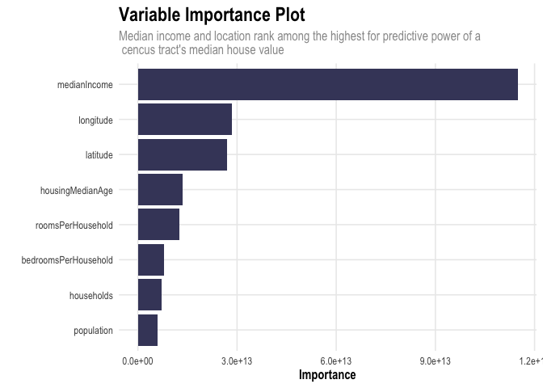

Exercises-3
================
Alice Kemp
2022-03-23

## What Causes What: The Effect of Police on Crime

1.  *Why can’t I just get data from a few different cities and run the
    regression of “Crime” on “Police” to understand how more cops in the
    streets affect crime? (“Crime” refers to some measure of crime rate
    and “Police” measures the number of cops in a city.)*  
    If you run a simple regression of “crime” on “police, you will not
    be controlling for the fact that cities with naturally higher crime
    rates tend to hire more police. Thus, you would need to control for
    this by using an instrumental variable or find an example where the
    amount of police dispatched in a day is independent of the level of
    criminal activity occurring.

2.  *How were the researchers from UPenn able to isolate this effect?
    Briefly describe their approach and discuss their result in the
    “Table 2” below, from the researchers’ paper.* Researchers from
    UPenn were able to isolate the effect of amount of police on
    criminal activity by finding an example where there was a high level
    of police on the streets unrelated to actual criminal activity - the
    terrorism alert system in D.C. that dispatched police based on the
    threat of terrorism, unrelated to the current level of street crime.
    In this example, researchers sought to discern what happens to
    street crime on days when the terror alert system was orange
    (moderate level). On these days, they found that crime rates
    decreased overall, however, a potential confounding issue was if
    this decline was simply due to fewer criminals and victims being out
    on the streets during these moderate to high terrorism threat
    levels. On orange alert days, daily crime rates were estimated to be
    -7.316% lower on average, ceteris paribus, than on low or no alert
    days. After controlling for a possible change in crime derived from
    individuals staying home on high alert days through metro ridership,
    daily crime rates were estimated to be -6.046% lower on average on
    high alert days, ceteris paribus.

3.  *Why did they have to control for Metro ridership? What was that
    trying to capture?*  
    A potential confounding issue was if the decline in crime was simply
    due to fewer criminals and victims being out on the streets during
    these moderate to high terrorism threat levels. Thus, controlling
    for Metro ridership, which was normal during these times, mitigated
    this issue.

4.  *Below I am showing you “Table 4” from the researchers’ paper. Just
    focus on the first column of the table. Can you describe the model
    being estimated here? What is the conclusion?*  
    The model being estimated is the reduction in crime on high alert
    days in District 1, containing D.C.’s National Mall. The researchers
    found that on average, there were 2.62 fewer crimes per day on all
    else held fixed, in District 1 han in other districts. Other
    districts show on average a reduction in crimes by 0.571 per day,
    ceteris paribus, however, this result is not statistically
    significant. Overall, there is a baseline -11.058 crime reduction on
    high alert days across all districts with Metro ridership being
    2.477% higher on high alert days.

## Tree Modeling: Dengue Cases

<!-- -->

    ## Distribution not specified, assuming gaussian ...

<table>
<caption>
Table 1.1: Model RMSE
</caption>
<thead>
<tr>
<th style="text-align:left;">
</th>
<th style="text-align:right;">
RMSE
</th>
</tr>
</thead>
<tbody>
<tr>
<td style="text-align:left;">
Decision Tree
</td>
<td style="text-align:right;">
33.35
</td>
</tr>
<tr>
<td style="text-align:left;">
Random Forest
</td>
<td style="text-align:right;">
32.59
</td>
</tr>
<tr>
<td style="text-align:left;">
Gradient-Boosted Trees
</td>
<td style="text-align:right;">
33.14
</td>
</tr>
</tbody>
</table>

<!-- --><!-- --><!-- -->

## Predictive model building: green certification

### Introduction

Pricing rental terms for office buildings in the commercial real estate
sector is a complex, multifaceted problem that incorporates a variety of
attributes including asset class, age, renovation status, number of
floors, location, and the availability of amenities. Within an asset
class and submarket, asking rates for office space tend to vary greatly
based on these differing characteristics. In this study, we investigate
how a building’s “green” rating impacts its revenue, calculated as the
building’s rent per square foot multiplied by its occupancy rate. As
efforts to increase sustainability by adding environmentally features
that certify a building to be LEED or Energystar certified, the
financial impacts and returns to investment become increasingly relevant
to a building’s landlord.

### Data

The data used in this study covers 7,894 properties extracted from a
leading commercial real estate database. The property attributes
included are geographic cluster, size, year-over-year local employment
growth, rent per square foot, leasing rate, stories, age, renovation
status, asset class, green rating, amenities, annual demand for cooling,
annual demand for heating, annual precipitation, utility costs, and
local market average rent. Of the 7,894 properties included in the
original data, 685 buildings are LEED or Energystar certified,
representing approximately 8.7%.

### Methodology

First, the data was cleaned to remove missing values and filtered to
include only buildings with full service gross rents to better compare
across properties. After filtering, the data set narrowed minimally to
7,546 total properties, including 640 green rated properties. Diving
deeper into the data, we find that the proportion of green rated
buildings is larger in Class A properties with 17.2% of buildings being
LEED or Energystar certified compared to only 2.8% of Class B
properties. This trend was utilized in the model analysis to investigate
whether or not green rated buildings had higher revenues than others,
both over all asset classes and specifically within Class A properties.
After creating the model, figures of actual versus predicted price were
created to visualize the distribution of revenues across green ratings.
Furthermore, a variable importance plot and a partial dependence plot
was created to investigate the relative predictive power of individual
attributes in the model and the marginal effects of these attributes on
revenue.

### Analysis and Conclusion

To build the best predictive model of revenue based on the given
features, a random forest model was created using an 80% train-test
split for cross validation purposes. Within the random forest model,
5-fold cross validation was used to prevent overfitting of the training
data. The model was then stress tested using the remaining test data
set, resulting in an RMSE of approximately $6.81/sf. Next, the data was
plotted with actual revenue of the test data against predicted revenue
to showcase model accuracy and any trends regarding green rating’s
impact on revenue. If LEED/Energystar rated buildings did garner higher
rents, we would see an outsize population of green buildings on the
graph where actual and/or predicted rents are higher. However, we do not
observe such a trend in the overall data. Next, we dug deeper into the
Class A data specifically, which tend to have a higher proportion of
green rated buildings than Class B or C properties. However, we again do
not observe an abnormally large amount of green rated buildings in the
upper ranges of predicted or actual revenue, indicating that green
rating has a minimal, if any, effect on a building’s revenue.

<table>
<caption>
Table 1.1: Proportion of Green Rated Buildings by Asset Class
</caption>
<thead>
<tr>
<th style="text-align:left;">
Class_A
</th>
<th style="text-align:left;">
Class_B
</th>
<th style="text-align:left;">
Green_Certified
</th>
<th style="text-align:left;">
Proportion
</th>
</tr>
</thead>
<tbody>
<tr>
<td style="text-align:left;">
0
</td>
<td style="text-align:left;">
0
</td>
<td style="text-align:left;">
0
</td>
<td style="text-align:left;">
23.5%
</td>
</tr>
<tr>
<td style="text-align:left;">
1
</td>
<td style="text-align:left;">
0
</td>
<td style="text-align:left;">
0
</td>
<td style="text-align:left;">
82.8%
</td>
</tr>
<tr>
<td style="text-align:left;">
0
</td>
<td style="text-align:left;">
1
</td>
<td style="text-align:left;">
0
</td>
<td style="text-align:left;">
73.5%
</td>
</tr>
<tr>
<td style="text-align:left;">
0
</td>
<td style="text-align:left;">
0
</td>
<td style="text-align:left;">
1
</td>
<td style="text-align:left;">
0.2%
</td>
</tr>
<tr>
<td style="text-align:left;">
1
</td>
<td style="text-align:left;">
0
</td>
<td style="text-align:left;">
1
</td>
<td style="text-align:left;">
17.2%
</td>
</tr>
<tr>
<td style="text-align:left;">
0
</td>
<td style="text-align:left;">
1
</td>
<td style="text-align:left;">
1
</td>
<td style="text-align:left;">
2.8%
</td>
</tr>
</tbody>
</table>
<table>
<caption>
Table 1.1: Random Forest RMSE
</caption>
<thead>
<tr>
<th style="text-align:right;">
</th>
</tr>
</thead>
<tbody>
<tr>
<td style="text-align:right;">
6.77
</td>
</tr>
</tbody>
</table>

<!-- --><!-- --><!-- -->

To further catalyze on this question, a partial dependence plot was
created to determine the marginal effect that a building being green
rated has on revenue. From the figure, we see there is a slight increase
in revenue for green buildings of approximately 0.34/sf. Looking at the
variable importance plot, we see that market rent, size, stories, and
age have the highest predictive power based on our model. Overall, we
find no significant evidence that green rated buildings garner higher
revenues than other buildings.

``` r
## PDP Plots - Green Rating
partial(green_forest, pred.var = "green_rating")
```

    ##   green_rating     yhat
    ## 1            0 24.07793
    ## 2            1 24.33559

``` r
partial(green_forest, pred.var = "green_rating", plot = TRUE,
              plot.engine = "ggplot2") + 
  my_theme +
  scale_color_viridis(option = "#444569") + 
  ggtitle("Partial Dependence Plot of Green Rating", subtitle = "Green certified buildings garner a minimal premium of $0.34/sf over non-green buildings.") + 
  xlab("Green Rating") + 
  ylab("Predicted Revenue ($/sf)") 
```

    ## Warning in viridisLite::viridis(256, alpha, begin, end, direction, option):
    ## Option '#444569' does not exist. Defaulting to 'viridis'.

    ## Warning: Use of `object[[1L]]` is discouraged. Use `.data[[1L]]` instead.

    ## Warning: Use of `object[["yhat"]]` is discouraged. Use `.data[["yhat"]]`
    ## instead.

<!-- -->

``` r
vip(green_forest, aesthetics = list(fill = "#444569"), all_permutations = TRUE) + 
  my_theme + 
  ggtitle("Variable Importance Plot", subtitle = "Green rating ranks among the lowest for predictive power of a building's revenue") 
```

<!-- -->

## Predictive model building: California housing

### Introduction

The aim of this analysis is to predict median house value of California
residential homes by census tract based on a selection of
characteristics in each census tract including median age, population,
number of households, number of rooms and bedrooms, and median income.  
\* longitude, latitude: coordinates of the geographic centroid of the
census tract \* housingMedianAge: median age in years of all residential
households in the census tract \* population: total population of the
tract \* households: total number of households in the tract. \*
totalRooms, totalBedrooms: total number of rooms and bedrooms for
households in the tract. NOTE: these are totals, not averages. Consider
standardizing by households. \* medianIncome: median household income in
USD for all households in the tract. \* medianHouseValue: median market
value of all households in the tract.

### Data

The data set used in this analysis includes information on 20,640 census
tracts in the state of California. The data was filtered to remove
missing values and the totalBedrooms and totalRooms variables were
normalized by dividing by the number of households in each tract.

### Methodology

First, the centroids of each cluster were mapped and colored according
to their median house value. Then, a random forest model was created to
predict median house value based on all above attributes. An 80%
train-test split was utilized to prevent overfitting of data. When
stress tested on the test set data, the random forest model generated an
out-of-sample fit of approximately $49,651.00. The predicted test set
values were then mapped with a color scale representing median house
value. Next, the residuals for each census tract were mapped with a
color scale representing the error generated from the random forest
model. Finally, a variable importance plot was created to show the
variables with the most predictive power in projecting median house
value.

### Conclusion

From the first figure, we observe that there are two obvious clusters of
high median home values located near the economic hubs of Los Angeles
and San Francisco. Near these clusters, we also observe the largest
errors from our random forest model, indicating that our model performs
worse in predicting home values in the upper quantile.

``` r
# load data and remove NAs
ca_housing = read_csv(here(("data/CAhousing.csv")), na = "NA", show_col_types = FALSE)
ca_housing = na.omit(ca_housing)
ca_housing$totalBedrooms = (ca_housing$totalBedrooms)/(ca_housing$households)
ca_housing$totalRooms = (ca_housing$totalRooms)/(ca_housing$households)
ca_housing = ca_housing %>%
  rename(
    bedroomsPerHousehold = totalBedrooms,
    roomsPerHousehold = totalRooms
  )

# plot house value data on map  
m = get_stamenmap(bbox = c(left = -128.00, bottom = 32.54, right = -110.00, top = 42.20),
          maptype = "terrain",
          color = "bw",
          crop = FALSE,
          zoom = 8)
```

    ## 140 tiles needed, this may take a while (try a smaller zoom).

    ## Source : http://tile.stamen.com/terrain/8/36/94.png

    ## Source : http://tile.stamen.com/terrain/8/37/94.png

    ## Source : http://tile.stamen.com/terrain/8/38/94.png

    ## Source : http://tile.stamen.com/terrain/8/39/94.png

    ## Source : http://tile.stamen.com/terrain/8/40/94.png

    ## Source : http://tile.stamen.com/terrain/8/41/94.png

    ## Source : http://tile.stamen.com/terrain/8/42/94.png

    ## Source : http://tile.stamen.com/terrain/8/43/94.png

    ## Source : http://tile.stamen.com/terrain/8/44/94.png

    ## Source : http://tile.stamen.com/terrain/8/45/94.png

    ## Source : http://tile.stamen.com/terrain/8/46/94.png

    ## Source : http://tile.stamen.com/terrain/8/47/94.png

    ## Source : http://tile.stamen.com/terrain/8/48/94.png

    ## Source : http://tile.stamen.com/terrain/8/49/94.png

    ## Source : http://tile.stamen.com/terrain/8/36/95.png

    ## Source : http://tile.stamen.com/terrain/8/37/95.png

    ## Source : http://tile.stamen.com/terrain/8/38/95.png

    ## Source : http://tile.stamen.com/terrain/8/39/95.png

    ## Source : http://tile.stamen.com/terrain/8/40/95.png

    ## Source : http://tile.stamen.com/terrain/8/41/95.png

    ## Source : http://tile.stamen.com/terrain/8/42/95.png

    ## Source : http://tile.stamen.com/terrain/8/43/95.png

    ## Source : http://tile.stamen.com/terrain/8/44/95.png

    ## Source : http://tile.stamen.com/terrain/8/45/95.png

    ## Source : http://tile.stamen.com/terrain/8/46/95.png

    ## Source : http://tile.stamen.com/terrain/8/47/95.png

    ## Source : http://tile.stamen.com/terrain/8/48/95.png

    ## Source : http://tile.stamen.com/terrain/8/49/95.png

    ## Source : http://tile.stamen.com/terrain/8/36/96.png

    ## Source : http://tile.stamen.com/terrain/8/37/96.png

    ## Source : http://tile.stamen.com/terrain/8/38/96.png

    ## Source : http://tile.stamen.com/terrain/8/39/96.png

    ## Source : http://tile.stamen.com/terrain/8/40/96.png

    ## Source : http://tile.stamen.com/terrain/8/41/96.png

    ## Source : http://tile.stamen.com/terrain/8/42/96.png

    ## Source : http://tile.stamen.com/terrain/8/43/96.png

    ## Source : http://tile.stamen.com/terrain/8/44/96.png

    ## Source : http://tile.stamen.com/terrain/8/45/96.png

    ## Source : http://tile.stamen.com/terrain/8/46/96.png

    ## Source : http://tile.stamen.com/terrain/8/47/96.png

    ## Source : http://tile.stamen.com/terrain/8/48/96.png

    ## Source : http://tile.stamen.com/terrain/8/49/96.png

    ## Source : http://tile.stamen.com/terrain/8/36/97.png

    ## Source : http://tile.stamen.com/terrain/8/37/97.png

    ## Source : http://tile.stamen.com/terrain/8/38/97.png

    ## Source : http://tile.stamen.com/terrain/8/39/97.png

    ## Source : http://tile.stamen.com/terrain/8/40/97.png

    ## Source : http://tile.stamen.com/terrain/8/41/97.png

    ## Source : http://tile.stamen.com/terrain/8/42/97.png

    ## Source : http://tile.stamen.com/terrain/8/43/97.png

    ## Source : http://tile.stamen.com/terrain/8/44/97.png

    ## Source : http://tile.stamen.com/terrain/8/45/97.png

    ## Source : http://tile.stamen.com/terrain/8/46/97.png

    ## Source : http://tile.stamen.com/terrain/8/47/97.png

    ## Source : http://tile.stamen.com/terrain/8/48/97.png

    ## Source : http://tile.stamen.com/terrain/8/49/97.png

    ## Source : http://tile.stamen.com/terrain/8/36/98.png

    ## Source : http://tile.stamen.com/terrain/8/37/98.png

    ## Source : http://tile.stamen.com/terrain/8/38/98.png

    ## Source : http://tile.stamen.com/terrain/8/39/98.png

    ## Source : http://tile.stamen.com/terrain/8/40/98.png

    ## Source : http://tile.stamen.com/terrain/8/41/98.png

    ## Source : http://tile.stamen.com/terrain/8/42/98.png

    ## Source : http://tile.stamen.com/terrain/8/43/98.png

    ## Source : http://tile.stamen.com/terrain/8/44/98.png

    ## Source : http://tile.stamen.com/terrain/8/45/98.png

    ## Source : http://tile.stamen.com/terrain/8/46/98.png

    ## Source : http://tile.stamen.com/terrain/8/47/98.png

    ## Source : http://tile.stamen.com/terrain/8/48/98.png

    ## Source : http://tile.stamen.com/terrain/8/49/98.png

    ## Source : http://tile.stamen.com/terrain/8/36/99.png

    ## Source : http://tile.stamen.com/terrain/8/37/99.png

    ## Source : http://tile.stamen.com/terrain/8/38/99.png

    ## Source : http://tile.stamen.com/terrain/8/39/99.png

    ## Source : http://tile.stamen.com/terrain/8/40/99.png

    ## Source : http://tile.stamen.com/terrain/8/41/99.png

    ## Source : http://tile.stamen.com/terrain/8/42/99.png

    ## Source : http://tile.stamen.com/terrain/8/43/99.png

    ## Source : http://tile.stamen.com/terrain/8/44/99.png

    ## Source : http://tile.stamen.com/terrain/8/45/99.png

    ## Source : http://tile.stamen.com/terrain/8/46/99.png

    ## Source : http://tile.stamen.com/terrain/8/47/99.png

    ## Source : http://tile.stamen.com/terrain/8/48/99.png

    ## Source : http://tile.stamen.com/terrain/8/49/99.png

    ## Source : http://tile.stamen.com/terrain/8/36/100.png

    ## Source : http://tile.stamen.com/terrain/8/37/100.png

    ## Source : http://tile.stamen.com/terrain/8/38/100.png

    ## Source : http://tile.stamen.com/terrain/8/39/100.png

    ## Source : http://tile.stamen.com/terrain/8/40/100.png

    ## Source : http://tile.stamen.com/terrain/8/41/100.png

    ## Source : http://tile.stamen.com/terrain/8/42/100.png

    ## Source : http://tile.stamen.com/terrain/8/43/100.png

    ## Source : http://tile.stamen.com/terrain/8/44/100.png

    ## Source : http://tile.stamen.com/terrain/8/45/100.png

    ## Source : http://tile.stamen.com/terrain/8/46/100.png

    ## Source : http://tile.stamen.com/terrain/8/47/100.png

    ## Source : http://tile.stamen.com/terrain/8/48/100.png

    ## Source : http://tile.stamen.com/terrain/8/49/100.png

    ## Source : http://tile.stamen.com/terrain/8/36/101.png

    ## Source : http://tile.stamen.com/terrain/8/37/101.png

    ## Source : http://tile.stamen.com/terrain/8/38/101.png

    ## Source : http://tile.stamen.com/terrain/8/39/101.png

    ## Source : http://tile.stamen.com/terrain/8/40/101.png

    ## Source : http://tile.stamen.com/terrain/8/41/101.png

    ## Source : http://tile.stamen.com/terrain/8/42/101.png

    ## Source : http://tile.stamen.com/terrain/8/43/101.png

    ## Source : http://tile.stamen.com/terrain/8/44/101.png

    ## Source : http://tile.stamen.com/terrain/8/45/101.png

    ## Source : http://tile.stamen.com/terrain/8/46/101.png

    ## Source : http://tile.stamen.com/terrain/8/47/101.png

    ## Source : http://tile.stamen.com/terrain/8/48/101.png

    ## Source : http://tile.stamen.com/terrain/8/49/101.png

    ## Source : http://tile.stamen.com/terrain/8/36/102.png

    ## Source : http://tile.stamen.com/terrain/8/37/102.png

    ## Source : http://tile.stamen.com/terrain/8/38/102.png

    ## Source : http://tile.stamen.com/terrain/8/39/102.png

    ## Source : http://tile.stamen.com/terrain/8/40/102.png

    ## Source : http://tile.stamen.com/terrain/8/41/102.png

    ## Source : http://tile.stamen.com/terrain/8/42/102.png

    ## Source : http://tile.stamen.com/terrain/8/43/102.png

    ## Source : http://tile.stamen.com/terrain/8/44/102.png

    ## Source : http://tile.stamen.com/terrain/8/45/102.png

    ## Source : http://tile.stamen.com/terrain/8/46/102.png

    ## Source : http://tile.stamen.com/terrain/8/47/102.png

    ## Source : http://tile.stamen.com/terrain/8/48/102.png

    ## Source : http://tile.stamen.com/terrain/8/49/102.png

    ## Source : http://tile.stamen.com/terrain/8/36/103.png

    ## Source : http://tile.stamen.com/terrain/8/37/103.png

    ## Source : http://tile.stamen.com/terrain/8/38/103.png

    ## Source : http://tile.stamen.com/terrain/8/39/103.png

    ## Source : http://tile.stamen.com/terrain/8/40/103.png

    ## Source : http://tile.stamen.com/terrain/8/41/103.png

    ## Source : http://tile.stamen.com/terrain/8/42/103.png

    ## Source : http://tile.stamen.com/terrain/8/43/103.png

    ## Source : http://tile.stamen.com/terrain/8/44/103.png

    ## Source : http://tile.stamen.com/terrain/8/45/103.png

    ## Source : http://tile.stamen.com/terrain/8/46/103.png

    ## Source : http://tile.stamen.com/terrain/8/47/103.png

    ## Source : http://tile.stamen.com/terrain/8/48/103.png

    ## Source : http://tile.stamen.com/terrain/8/49/103.png

``` r
ggmap(m) + 
  geom_point(data = ca_housing, aes(x = longitude, y = latitude, color = medianHouseValue, alpha = 0.8)) + 
  scale_color_viridis(option = "mako", label = dollar_format()) + 
  my_scatter_theme + 
  guides(alpha="none") + 
  labs(color = "median value") +
  scale_x_discrete(labels = NULL, breaks = NULL) +
  scale_y_discrete(labels = NULL, breaks = NULL) +
  xlab("") + 
  ylab("") + 
  ggtitle("Median Residential Home Values in CA",
          subtitle = "Residential house values are highest near California's coastline, with the most expensive \n homes clustering around the state's economic hubs of Los Angeles and the Bay Area.")
```

    ## Scale for 'x' is already present. Adding another scale for 'x', which will
    ## replace the existing scale.

    ## Scale for 'y' is already present. Adding another scale for 'y', which will
    ## replace the existing scale.

    ## Warning in min(x): no non-missing arguments to min; returning Inf

    ## Warning in max(x): no non-missing arguments to max; returning -Inf

    ## Warning in min(x): no non-missing arguments to min; returning Inf

    ## Warning in max(x): no non-missing arguments to max; returning -Inf

    ## Warning in min(x): no non-missing arguments to min; returning Inf

    ## Warning in max(x): no non-missing arguments to max; returning -Inf

    ## Warning in min(x): no non-missing arguments to min; returning Inf

    ## Warning in max(x): no non-missing arguments to max; returning -Inf

<!-- -->

``` r
# split into train test 
set.seed(123)
house_split = initial_split(ca_housing, 0.8)
house_train = training(house_split)
house_test = testing(house_split)

# create RF model 
forest_house = randomForest(medianHouseValue ~ ., data = house_train, mtry = 8, ntree = 50)
yhat_train = predict(forest_house, house_train) # in sample fit 
rmse_train = mean((yhat_train - house_train$medianHouseValue)^2) %>% sqrt

yhat_forest = predict(forest_house, house_test) # out of sample fit 
rmse_forest = mean((yhat_forest - house_test$medianHouseValue)^2) %>% sqrt
house_pred = house_test %>% cbind(yhat_forest)
kable(rmse_forest, digits=2, col.names = "", caption = "Table 1.1: Random Forest RMSE")
```

<table>
<caption>
Table 1.1: Random Forest RMSE
</caption>
<thead>
<tr>
<th style="text-align:right;">
</th>
</tr>
</thead>
<tbody>
<tr>
<td style="text-align:right;">
49651.45
</td>
</tr>
</tbody>
</table>

``` r
# plot predicted values
ggmap(m) + 
  geom_point(data = house_pred, aes(x = longitude, y = latitude, color = yhat_forest, alpha = 0.8)) + 
  scale_color_viridis(option = "mako", labels = dollar_format()) + 
  my_scatter_theme + 
  guides(alpha="none") + 
  labs(color = "predicted value") +
  scale_x_discrete(labels = NULL, breaks = NULL) +
  scale_y_discrete(labels = NULL, breaks = NULL) +
  xlab("") + 
  ylab("") + 
  ggtitle("Predicted Median Residential Home Values in CA",
          subtitle = "Median residential home values predicted using Random Forest model with 50 trees .")
```

    ## Scale for 'x' is already present. Adding another scale for 'x', which will
    ## replace the existing scale.
    ## Scale for 'y' is already present. Adding another scale for 'y', which will
    ## replace the existing scale.

    ## Warning in min(x): no non-missing arguments to min; returning Inf

    ## Warning in min(x): no non-missing arguments to max; returning -Inf

    ## Warning in min(x): no non-missing arguments to min; returning Inf

    ## Warning in max(x): no non-missing arguments to max; returning -Inf

    ## Warning in min(x): no non-missing arguments to min; returning Inf

    ## Warning in max(x): no non-missing arguments to max; returning -Inf

    ## Warning in min(x): no non-missing arguments to min; returning Inf

    ## Warning in max(x): no non-missing arguments to max; returning -Inf

<!-- -->

``` r
# plot residuals/errors
house_err = house_pred %>% 
  mutate(
    resid = abs(yhat_forest - medianHouseValue)
  )
ggmap(m) + 
  geom_point(data = house_err, aes(x = longitude, y = latitude, color = resid, alpha = 0.7)) + 
  scale_color_viridis(option = "inferno", labels = dollar_format()) + 
  my_scatter_theme + 
  guides(alpha="none") +
  labs(color = "error") + 
  scale_x_discrete(labels = NULL, breaks = NULL) +
  scale_y_discrete(labels = NULL, breaks = NULL) + 
  xlab("") + 
  ylab("") + 
  ggtitle("Predicted Error for Residential Home Values in CA",
          subtitle = "Residuals tend to be larger in California's biggest cities along the coast, areas that also garner the state's highest median prices.")
```

    ## Scale for 'x' is already present. Adding another scale for 'x', which will
    ## replace the existing scale.
    ## Scale for 'y' is already present. Adding another scale for 'y', which will
    ## replace the existing scale.

    ## Warning in min(x): no non-missing arguments to min; returning Inf

    ## Warning in min(x): no non-missing arguments to max; returning -Inf

    ## Warning in min(x): no non-missing arguments to min; returning Inf

    ## Warning in max(x): no non-missing arguments to max; returning -Inf

    ## Warning in min(x): no non-missing arguments to min; returning Inf

    ## Warning in max(x): no non-missing arguments to max; returning -Inf

    ## Warning in min(x): no non-missing arguments to min; returning Inf

    ## Warning in max(x): no non-missing arguments to max; returning -Inf

<!-- -->

``` r
vip(forest_house, aesthetics = list(fill = "#444569"), all_permutations = TRUE) + 
  my_theme + 
  ggtitle("Variable Importance Plot", subtitle = "Median income and location rank among the highest for predictive power of a \n cencus tract's median house value") 
```

<!-- -->
