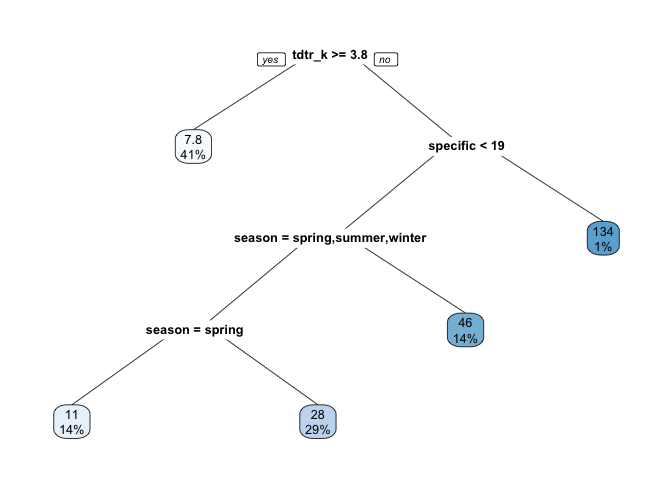
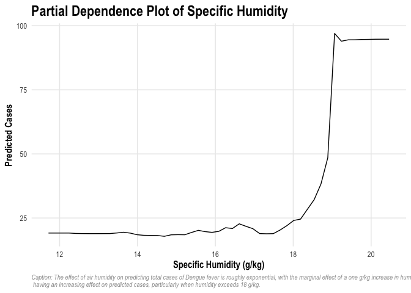

Exercises-3
================
Alice Kemp -
ECON395m - Spring 2022

## What Causes What: The Effect of Police on Crime

1.  *Why can’t I just get data from a few different cities and run the
    regression of “Crime” on “Police” to understand how more cops in the
    streets affect crime? (“Crime” refers to some measure of crime rate
    and “Police” measures the number of cops in a city.)*  
    If you run a simple regression of “crime” on “police, you will not
    be controlling for the fact that cities with naturally higher crime
    rates tend to hire more police. Thus, you would need to control for
    this by using an instrumental variable or find an example where the
    amount of police dispatched in a day is independent of the level of
    criminal activity occurring.

2.  *How were the researchers from UPenn able to isolate this effect?
    Briefly describe their approach and discuss their result in the
    “Table 2” below, from the researchers’ paper.*  
    Researchers from UPenn were able to isolate the effect of amount of
    police on criminal activity by finding an example where there was a
    high level of police on the streets unrelated to actual criminal
    activity - the terrorism alert system in D.C. that dispatched police
    based on the threat of terrorism, unrelated to the current level of
    street crime. In this example, researchers sought to discern what
    happens to street crime on days when the terror alert system was
    orange (moderate level). On these days, they found that crime rates
    decreased overall, however, a potential confounding issue was if
    this decline was simply due to fewer criminals and victims being out
    on the streets during these moderate to high terrorism threat
    levels. On orange alert days, daily crime rates were estimated to be
    -7.316% lower on average, ceteris paribus, than on low or no alert
    days. After controlling for a possible change in crime derived from
    individuals staying home on high alert days through metro ridership,
    daily crime rates were estimated to be -6.046% lower on average on
    high alert days, ceteris paribus.

3.  *Why did they have to control for Metro ridership? What was that
    trying to capture?*  
    A potential confounding issue was if the decline in crime was simply
    due to fewer criminals and victims being out on the streets during
    these moderate to high terrorism threat levels. Thus, controlling
    for Metro ridership, which was normal during these times, mitigated
    this issue.

4.  *Below I am showing you “Table 4” from the researchers’ paper. Just
    focus on the first column of the table. Can you describe the model
    being estimated here? What is the conclusion?*  
    The model being estimated is the reduction in crime on high alert
    days in District 1, containing D.C.’s National Mall. The researchers
    found that on average, there were 2.62 fewer crimes per day on all
    else held fixed, in District 1 han in other districts. Other
    districts show on average a reduction in crimes by 0.571 per day,
    ceteris paribus, however, this result is not statistically
    significant. Overall, there is a baseline -11.058 crime reduction on
    high alert days across all districts with Metro ridership being
    2.477% higher on high alert days.

## Tree Modeling: Dengue Cases

### Data

In this analysis, we use data pertaining to weekly rates of dengue fever
in two Latin American cities, San Juan, Puerto Rico and Iquitos, Peru to
predict future cases based on a variety of environmental and geographic
factors including city, season, specific humidity level, average diurnal
temperature range, average temperature, and weekly precipitation levels.

### Methodology

In this analysis, we ran three statistical models to predict cases of
dengue fever based on the available features. In the CART model, we
found an average out-of-sample error of approximately 32.41 cases, while
the Gradient-Boosted Trees (GBM) model returned an out-of-sample error
of 29.81 cases. The Random Forest model outperformed both of the
aforementioned models with an out-of-sample RMSE of 29 cases. Lastly, we
investigate the partial dependence of select environmental variables on
predicted dengue fever cases.

<!-- -->

    ## Distribution not specified, assuming gaussian ...

<table>
<caption>
Random Forest RMSE
</caption>
<thead>
<tr>
<th style="text-align:left;">
</th>
<th style="text-align:right;">
RMSE
</th>
</tr>
</thead>
<tbody>
<tr>
<td style="text-align:left;">
Decision Tree
</td>
<td style="text-align:right;">
32.41
</td>
</tr>
<tr>
<td style="text-align:left;">
Random Forest
</td>
<td style="text-align:right;">
29.00
</td>
</tr>
<tr>
<td style="text-align:left;">
Gradient-Boosted Trees
</td>
<td style="text-align:right;">
29.81
</td>
</tr>
</tbody>
</table>

<!-- --><!-- --><!-- -->

### Conclusion

In predicting cases of dengue fever in Latin America, we find that the
Random Forest model outperformed both the CART and GBM models with the
lowest out-of-sample RMSE of the three. Plotting the partial dependence
of choice variables yields informative results of the impact of certain
environmental features on predicted cases. In particular, specific
humidity in the 12-18 g/kg range shows a virtually steady impact on
predicted cases of approximately 20 cases. However, as humidity
increases from 18 to 20 g/kg, we find that the marginal impact on
predicted cases increases at an increasingly steep rate, with predicted
values leveling off at approximately 50 cases. Next, we investigate the
marginal effect of precipitation levels and find that predicted cases
increase moderately in the \>0 to 200 mm range before steeply increasing
to a ceiling of roughly 37 cases. Finally, we observe that the effect of
average temperature on predicting total cases changes, with the marginal
effect of a one degree Kelvin increase in average temperature yielding a
decline in predicted cases for temperatures below 300°K. After this
point, an increase in average temperature has a positive effect on
predicted cases until the maximum case threshold is reached.

## Predictive model building: green certification

### Introduction

Pricing rental terms for office buildings in the commercial real estate
sector is a complex, multifaceted problem that incorporates a variety of
attributes including asset class, age, renovation status, number of
floors, location, and the availability of amenities. Within an asset
class and submarket, asking rates for office space tend to vary greatly
based on these differing characteristics. In this study, we investigate
how a building’s “green” rating impacts its revenue, calculated as the
building’s rent per square foot multiplied by its occupancy rate. As
efforts to increase sustainability by adding environmentally features
that certify a building to be LEED or Energystar certified, the
financial impacts and returns to investment become increasingly relevant
to a building’s landlord.

### Data

The data used in this study covers 7,894 properties extracted from a
leading commercial real estate database. The property attributes
included are geographic cluster, size, year-over-year local employment
growth, rent per square foot, leasing rate, stories, age, renovation
status, asset class, green rating, amenities, annual demand for cooling,
annual demand for heating, annual precipitation, utility costs, and
local market average rent. Of the 7,894 properties included in the
original data, 685 buildings are LEED or Energystar certified,
representing approximately 8.7%.

### Methodology

First, the data was cleaned to remove missing values and filtered to
include only buildings with full service gross rents to better compare
across properties. After filtering, the data set narrowed minimally to
7,546 total properties, including 640 green rated properties. Diving
deeper into the data, we find that the proportion of green rated
buildings is larger in Class A properties with 17.2% of buildings being
LEED or Energystar certified compared to only 2.8% of Class B
properties. This trend was utilized in the model analysis to investigate
whether or not green rated buildings had higher revenues than others,
both over all asset classes and specifically within Class A properties.
After creating the model, figures of actual versus predicted price were
created to visualize the distribution of revenues across green ratings.
Furthermore, a variable importance plot and a partial dependence plot
was created to investigate the relative predictive power of individual
attributes in the model and the marginal effects of these attributes on
revenue.

<table>
<caption>
Table 1.1: Proportion of Green Rated Buildings by Asset Class
</caption>
<thead>
<tr>
<th style="text-align:left;">
Class_A
</th>
<th style="text-align:left;">
Class_B
</th>
<th style="text-align:left;">
Green_Certified
</th>
<th style="text-align:left;">
Proportion
</th>
</tr>
</thead>
<tbody>
<tr>
<td style="text-align:left;">
0
</td>
<td style="text-align:left;">
0
</td>
<td style="text-align:left;">
0
</td>
<td style="text-align:left;">
23.5%
</td>
</tr>
<tr>
<td style="text-align:left;">
1
</td>
<td style="text-align:left;">
0
</td>
<td style="text-align:left;">
0
</td>
<td style="text-align:left;">
82.8%
</td>
</tr>
<tr>
<td style="text-align:left;">
0
</td>
<td style="text-align:left;">
1
</td>
<td style="text-align:left;">
0
</td>
<td style="text-align:left;">
73.5%
</td>
</tr>
<tr>
<td style="text-align:left;">
0
</td>
<td style="text-align:left;">
0
</td>
<td style="text-align:left;">
1
</td>
<td style="text-align:left;">
0.2%
</td>
</tr>
<tr>
<td style="text-align:left;">
1
</td>
<td style="text-align:left;">
0
</td>
<td style="text-align:left;">
1
</td>
<td style="text-align:left;">
17.2%
</td>
</tr>
<tr>
<td style="text-align:left;">
0
</td>
<td style="text-align:left;">
1
</td>
<td style="text-align:left;">
1
</td>
<td style="text-align:left;">
2.8%
</td>
</tr>
</tbody>
</table>
<table>
<caption>
Random Forest RMSE
</caption>
<thead>
<tr>
<th style="text-align:right;">
x
</th>
</tr>
</thead>
<tbody>
<tr>
<td style="text-align:right;">
6.7683
</td>
</tr>
</tbody>
</table>

<!-- --><!-- --><!-- -->

### Conclusion

To build the best predictive model of revenue based on the given
features, a random forest model was created using an 80% train-test
split for cross validation purposes. Within the random forest model,
5-fold cross validation was used to prevent overfitting of the training
data. The model was then stress tested using the remaining test data
set, resulting in an RMSE of approximately $6.81/sf. Next, the data was
plotted with actual revenue of the test data against predicted revenue
to showcase model accuracy and any trends regarding green rating’s
impact on revenue. If LEED/Energystar rated buildings did garner higher
rents, we would see an outsize population of green buildings on the
graph where actual and/or predicted rents are higher. However, we do not
observe such a trend in the overall data. Next, we dug deeper into the
Class A data specifically, which tend to have a higher proportion of
green rated buildings than Class B or C properties. However, we again do
not observe an abnormally large amount of green rated buildings in the
upper ranges of predicted or actual revenue, indicating that green
rating has a minimal, if any, effect on a building’s revenue.  
To further catalyze on this question, a partial dependence plot was
created to determine the marginal effect that a building being green
rated has on revenue. From the figure, we see there is a slight increase
in revenue for green buildings of approximately 0.34/sf. Looking at the
variable importance plot, we see that market rent, size, stories, and
age have the highest predictive power based on our model. Overall, we
find no significant evidence that green rated buildings garner higher
revenues than other buildings.

<table>
<caption>
Partial Dependence of Green Rating
</caption>
<thead>
<tr>
<th style="text-align:right;">
green_rating
</th>
<th style="text-align:right;">
yhat
</th>
</tr>
</thead>
<tbody>
<tr>
<td style="text-align:right;">
0
</td>
<td style="text-align:right;">
24.08
</td>
</tr>
<tr>
<td style="text-align:right;">
1
</td>
<td style="text-align:right;">
24.34
</td>
</tr>
</tbody>
</table>

<!-- --><!-- -->

## Predictive model building: California housing

### Introduction

The aim of this analysis is to predict median house value of California
residential homes by census tract based on a selection of
characteristics in each census tract including median age, population,
number of households, number of rooms and bedrooms, and median income.  
\* longitude, latitude: coordinates of the geographic centroid of the
census tract  
\* housingMedianAge: median age in years of all residential households
in the census tract  
\* population: total population of the tract  
\* households: total number of households in the tract  
\* totalRooms, totalBedrooms: total number of rooms and bedrooms for
households in the tract  
\* medianIncome: median household income in USD for all households in
the tract  
\* medianHouseValue: median market value of all households in the tract

### Data

The data set used in this analysis includes information on 20,640 census
tracts in the state of California. The data was filtered to remove
missing values and the totalBedrooms and totalRooms variables were
normalized by dividing by the number of households in each tract.

### Methodology

First, the centroids of each cluster were mapped and colored according
to their median house value. Then, a random forest model was created to
predict median house value based on all above attributes. An 80%
train-test split was utilized to prevent overfitting of data. When
stress tested on the test set data, the random forest model generated an
out-of-sample fit of approximately $49,651.00. The predicted test set
values were then mapped with a color scale representing median house
value. Next, the residuals for each census tract were mapped with a
color scale representing the error generated from the random forest
model. Finally, a variable importance plot was created to show the
variables with the most predictive power in projecting median house
value.

<!-- --><!-- --><!-- -->

### Conclusion

From the first figure, we observe that there are two obvious clusters of
high median home values located near the economic hubs of Los Angeles
and San Francisco. Near these clusters, we also observe the largest
errors from our random forest model, indicating that our model performs
worse in predicting home values in the upper quantiles of median home
values. In the final figure, we visualize the predictive power of the
Random Forest model’s features using a variable importance plot. From
this plot, we conclude that a census tract’s median income, geographic
location, and median age are the most important features in predicting
median house value, with population, number of households, and
rooms/bedrooms per household ranking among the lowest in terms of
predictive power. These results tend to support the underlying data
trends with higher income census tracts being associated with higher
median home prices in the Los Angeles and San Francisco areas.

<!-- --><!-- -->
