Exercises 4
================
Alice Kemp
ECO395M - Spring 2022

# Clustering and PCA

## Data

The data used in this analysis includes information on 11 different
chemical properties of 6,500 bottles of wine from the Northern Portugal
area. In this analysis, we seek to naturally recover whether a wine was
red or white, along with the bottle’s quality level, scored on a numeric
scale from one to ten. In addition, we will uncover the most important
features that distinguish a red from a white wine and their quality
scores.

## Methodology

First, the data was cleaned to remove any missing values. Then, a
K-means unsupervised clustering method was performed using an optimal K
of 2 for clustering to red verus white and by quality. The data was
normalized using the z-score technique in order to use the K-means
clustering algorithm. Next, the unscaled data was analyzed using
Principle Components Analysis or PCA to uncover the chemical property
weights that make up red and white wines and that influence the quality
of the wine.

## Interpretation

Looking at Figure 1, we see that there appear to be two distinct
clusters found using k-means with k equal to two, indicating that color
may be a valid clustering factor. However, in the second graph, we
observe less distinct groups with a k value of five, indicating that
quality may not be as significant of a clustering factor as color. In
Figure 3, we see that the K-means clustering algorithm did
overwhelmingly sort the wines by color, with cluster 1 including mainly
white wines and cluster two including mostly red wines. In Figure 4,
however, we see that each cluster does not tend to be comprised of
similar quality scores, showing that wines do not tend to naturally
separate by quality score - perhaps the quality score indicator is not
consistently correlated with the same characteristics across wine
(i.e. ph level, sulfates, acidity, color).  
From the Principle Componente Analysis of rank 2, we find that wines in
PC1 differ from wines in PC2 due to higher levels of free and total
sulfur dioxide, low density, low alcohol, high sulphates, and volatile
acidity. In comparison, wines in PC2 tend to be lower in volatile
acidity, much lower in sulfur dioxide, much higher in density and much
higher in alcohol. After plotting PC1 versus PC2 and coloring by wine
color, we find that there does appear to be a distinct split in color
based on principle components with white wines belonging to PC1 and red
wines belonging to PC2 - this is essentially the same result from our
K-means derived clustering above. Similarly, quality score does not seem
to be a consistent clustering determinant for wine with no clear
separation by principle components. If anything, lower quality scores
appear to have negative PC2 weights, while higher scored wines may have
larger PC2 weights.

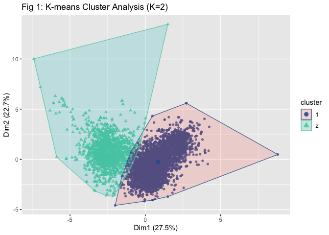<!-- -->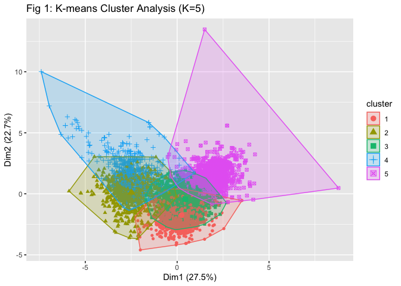<!-- -->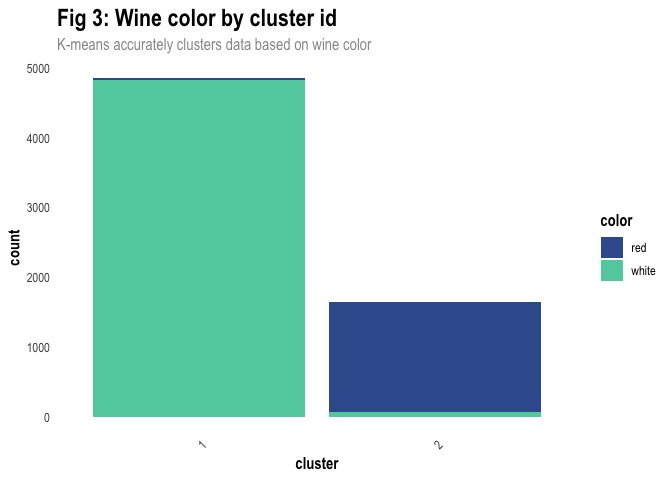<!-- -->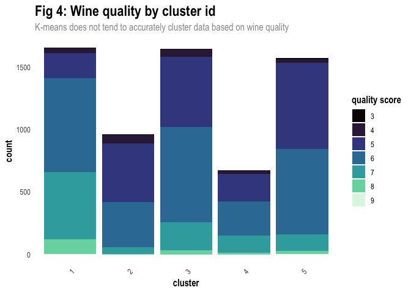<!-- -->

    ##                              PC1         PC2
    ## fixed.acidity        -0.23879890  0.33635454
    ## volatile.acidity     -0.38075750  0.11754972
    ## citric.acid           0.15238844  0.18329940
    ## residual.sugar        0.34591993  0.32991418
    ## chlorides            -0.29011259  0.31525799
    ## free.sulfur.dioxide   0.43091401  0.07193260
    ## total.sulfur.dioxide  0.48741806  0.08726628
    ## density              -0.04493664  0.58403734
    ## pH                   -0.21868644 -0.15586900
    ## sulphates            -0.29413517  0.19171577
    ## alcohol              -0.10643712 -0.46505769

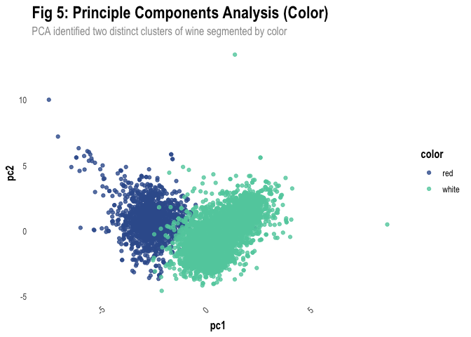<!-- -->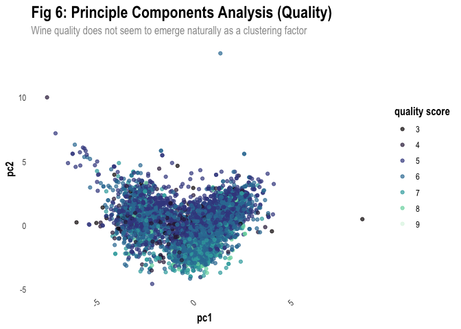<!-- -->

# Market segmentation

## Data

To investigate trends in customer behavior, Twitter data was collected
over a seven-day period in June 2014. For each of NutrientH2O’s 7,882
followers, a snapshot of each tweet posted during this period was taken.
Next, Amazon’s Mechanical Turk service was utilized to catalogue each
user’s tweets into 36 distinct categories, each representing a general
area of interest (e.g. politics, sports, family, etc.). In addition,
tweets were flagged as “spam” or “adult” for inappropriate content.
Individual catalogued weets were then aggregated and anonymized at the
user level, with numeric counts of tweets sorted into each interest
category. For this analysis, any users with tweets flagged as spam or
adult were excluded to accurately identify target customer clusters for
the Company.

    ##           X chatter current_events travel photo_sharing uncategorized tv_film
    ## 1 hmjoe4g3k       2              0      2             2             2       1
    ## 2 clk1m5w8s       3              3      2             1             1       1
    ## 3 jcsovtak3       6              3      4             3             1       5
    ## 4 3oeb4hiln       1              5      2             2             0       1
    ## 5 fd75x1vgk       5              2      0             6             1       0
    ## 6 h6nvj91yp       6              4      2             7             0       1
    ##   sports_fandom politics food family home_and_garden music news online_gaming
    ## 1             1        0    4      1               2     0    0             0
    ## 2             4        1    2      2               1     0    0             0
    ## 3             0        2    1      1               1     1    1             0
    ## 4             0        1    0      1               0     0    0             0
    ## 5             0        2    0      1               0     0    0             3
    ## 6             1        0    2      1               1     1    0             0
    ##   shopping health_nutrition college_uni sports_playing cooking eco computers
    ## 1        1               17           0              2       5   1         1
    ## 2        0                0           0              1       0   0         0
    ## 3        2                0           0              0       2   1         0
    ## 4        0                0           1              0       0   0         0
    ## 5        2                0           4              0       1   0         1
    ## 6        5                0           0              0       0   0         1
    ##   business outdoors crafts automotive art religion beauty parenting dating
    ## 1        0        2      1          0   0        1      0         1      1
    ## 2        1        0      2          0   0        0      0         0      1
    ## 3        0        0      2          0   8        0      1         0      1
    ## 4        1        0      3          0   2        0      1         0      0
    ## 5        0        1      0          0   0        0      0         0      0
    ## 6        1        0      0          1   0        0      0         0      0
    ##   school personal_fitness fashion small_business spam adult
    ## 1      0               11       0              0    0     0
    ## 2      4                0       0              0    0     0
    ## 3      0                0       1              0    0     0
    ## 4      0                0       0              0    0     0
    ## 5      0                0       0              1    0     0
    ## 6      0                0       0              0    0     0

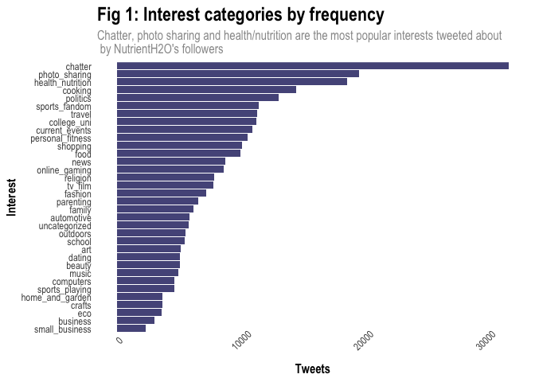<!-- -->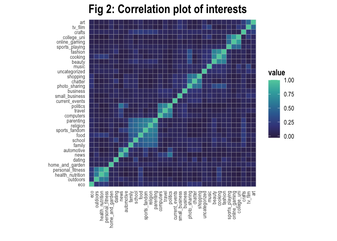<!-- -->

## Methodology

Two clustering techniques were used to sort the Company’s Twitter
followers into groups with similar attributes. First, an unsupervised
K-means algorithm was used to narturally identify like clusters
according to users’ tweet identities. The Elbow method was used to
select an optimal number of clusters, with variance decreasing at
approximately at an optimal K value of 5. As the raw data already used
the same numerical scale for flagged categorical counts, the data was
not normalized. Next, the clusters were plotted by the average values of
each interest category. Finally, PCA with rank 1 was performed to
analyze the most heavily weighted interests in each cluster to form the
five customer segmentations identified using K-means.

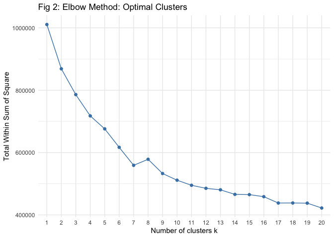<!-- -->

## Findings

The K-means unsupervised algorithm with an optimal k-value of four
identified distinct clusters that represent the key customers of
NutrientH2O. As seen in Figure 3, all clusters had a fairly high
proportion of tweets categorized as “chatter” and “photo-sharing”. This
is not surprising as these are general categories that apply to many
tweets. Looking past these two categories, the clusters diverge by their
next most common interests. Cluster one politics, travel, news and
current events as their highest average tweet categories while cluster
two averaged highest in health and nutrition, personal fitness,
outdoors, and cooking. The third cluster averaged highest in shopping,
cooking, and fashion and beauty while the fourth cluster included mostly
sports, online gaming, and college/university tweets. Overall,
NutrientH2O’s Twitter followers seem to fall into four main categories
that appear to vary based on age and gender. To further decompose the
main interests of the four clusters, we will next use Principle
Component Analysis of rank one.

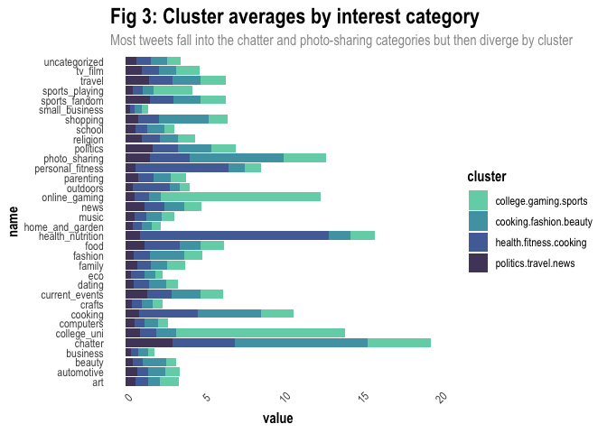<!-- -->

After performing PCA on each cluster, we were able to identify the top
interests for each customer cluster that solidified our findings from
the original k-means averages of each cluster. The first cluster of
followers tended to tweet most about politics, travel, and news, which
we believe represents and older customer left of center on the political
spectrum. The second cluster identified younger, most likely
college-aged customers whose interests included college/university,
online gaming, and sports. The third cluster tended to associate
customers with health and nutrition, fitness, and cooking, while the
fourth and final cluster identified customers who tweeted mostly about
cooking, fashion, and beauty. These four dominant clusters maximize the
variance between groups.

<table>
<thead>
<tr>
<th style="text-align:left;">
</th>
<th style="text-align:right;">
PC1
</th>
</tr>
</thead>
<tbody>
<tr>
<td style="text-align:left;">
chatter
</td>
<td style="text-align:right;">
0.0315044
</td>
</tr>
<tr>
<td style="text-align:left;">
photo_sharing
</td>
<td style="text-align:right;">
0.0276183
</td>
</tr>
<tr>
<td style="text-align:left;">
shopping
</td>
<td style="text-align:right;">
0.0170804
</td>
</tr>
<tr>
<td style="text-align:left;">
health_nutrition
</td>
<td style="text-align:right;">
0.0066606
</td>
</tr>
<tr>
<td style="text-align:left;">
fashion
</td>
<td style="text-align:right;">
0.0056468
</td>
</tr>
<tr>
<td style="text-align:left;">
cooking
</td>
<td style="text-align:right;">
0.0042316
</td>
</tr>
<tr>
<td style="text-align:left;">
uncategorized
</td>
<td style="text-align:right;">
0.0016401
</td>
</tr>
<tr>
<td style="text-align:left;">
clusters
</td>
<td style="text-align:right;">
0.0000000
</td>
</tr>
<tr>
<td style="text-align:left;">
personal_fitness
</td>
<td style="text-align:right;">
-0.0001384
</td>
</tr>
<tr>
<td style="text-align:left;">
beauty
</td>
<td style="text-align:right;">
-0.0015288
</td>
</tr>
<tr>
<td style="text-align:left;">
music
</td>
<td style="text-align:right;">
-0.0063411
</td>
</tr>
<tr>
<td style="text-align:left;">
online_gaming
</td>
<td style="text-align:right;">
-0.0085950
</td>
</tr>
<tr>
<td style="text-align:left;">
sports_playing
</td>
<td style="text-align:right;">
-0.0139762
</td>
</tr>
<tr>
<td style="text-align:left;">
eco
</td>
<td style="text-align:right;">
-0.0140294
</td>
</tr>
<tr>
<td style="text-align:left;">
small_business
</td>
<td style="text-align:right;">
-0.0151045
</td>
</tr>
<tr>
<td style="text-align:left;">
home_and_garden
</td>
<td style="text-align:right;">
-0.0160333
</td>
</tr>
<tr>
<td style="text-align:left;">
crafts
</td>
<td style="text-align:right;">
-0.0198237
</td>
</tr>
<tr>
<td style="text-align:left;">
current_events
</td>
<td style="text-align:right;">
-0.0220838
</td>
</tr>
<tr>
<td style="text-align:left;">
art
</td>
<td style="text-align:right;">
-0.0227610
</td>
</tr>
<tr>
<td style="text-align:left;">
tv_film
</td>
<td style="text-align:right;">
-0.0249963
</td>
</tr>
<tr>
<td style="text-align:left;">
college_uni
</td>
<td style="text-align:right;">
-0.0262230
</td>
</tr>
<tr>
<td style="text-align:left;">
business
</td>
<td style="text-align:right;">
-0.0275645
</td>
</tr>
<tr>
<td style="text-align:left;">
dating
</td>
<td style="text-align:right;">
-0.0300482
</td>
</tr>
<tr>
<td style="text-align:left;">
school
</td>
<td style="text-align:right;">
-0.0319829
</td>
</tr>
<tr>
<td style="text-align:left;">
family
</td>
<td style="text-align:right;">
-0.0356299
</td>
</tr>
<tr>
<td style="text-align:left;">
outdoors
</td>
<td style="text-align:right;">
-0.0363634
</td>
</tr>
<tr>
<td style="text-align:left;">
parenting
</td>
<td style="text-align:right;">
-0.0683033
</td>
</tr>
<tr>
<td style="text-align:left;">
religion
</td>
<td style="text-align:right;">
-0.0782005
</td>
</tr>
<tr>
<td style="text-align:left;">
food
</td>
<td style="text-align:right;">
-0.0915539
</td>
</tr>
<tr>
<td style="text-align:left;">
automotive
</td>
<td style="text-align:right;">
-0.1217541
</td>
</tr>
<tr>
<td style="text-align:left;">
sports_fandom
</td>
<td style="text-align:right;">
-0.1282757
</td>
</tr>
<tr>
<td style="text-align:left;">
computers
</td>
<td style="text-align:right;">
-0.1903334
</td>
</tr>
<tr>
<td style="text-align:left;">
news
</td>
<td style="text-align:right;">
-0.3677906
</td>
</tr>
<tr>
<td style="text-align:left;">
travel
</td>
<td style="text-align:right;">
-0.4426374
</td>
</tr>
<tr>
<td style="text-align:left;">
politics
</td>
<td style="text-align:right;">
-0.7556504
</td>
</tr>
</tbody>
</table>
<table>
<thead>
<tr>
<th style="text-align:left;">
</th>
<th style="text-align:right;">
PC1
</th>
</tr>
</thead>
<tbody>
<tr>
<td style="text-align:left;">
news
</td>
<td style="text-align:right;">
0.0208703
</td>
</tr>
<tr>
<td style="text-align:left;">
clusters
</td>
<td style="text-align:right;">
0.0000000
</td>
</tr>
<tr>
<td style="text-align:left;">
business
</td>
<td style="text-align:right;">
-0.0003799
</td>
</tr>
<tr>
<td style="text-align:left;">
music
</td>
<td style="text-align:right;">
-0.0004284
</td>
</tr>
<tr>
<td style="text-align:left;">
computers
</td>
<td style="text-align:right;">
-0.0039566
</td>
</tr>
<tr>
<td style="text-align:left;">
parenting
</td>
<td style="text-align:right;">
-0.0066541
</td>
</tr>
<tr>
<td style="text-align:left;">
sports_fandom
</td>
<td style="text-align:right;">
-0.0066645
</td>
</tr>
<tr>
<td style="text-align:left;">
beauty
</td>
<td style="text-align:right;">
-0.0066851
</td>
</tr>
<tr>
<td style="text-align:left;">
outdoors
</td>
<td style="text-align:right;">
-0.0073935
</td>
</tr>
<tr>
<td style="text-align:left;">
crafts
</td>
<td style="text-align:right;">
-0.0091770
</td>
</tr>
<tr>
<td style="text-align:left;">
school
</td>
<td style="text-align:right;">
-0.0111732
</td>
</tr>
<tr>
<td style="text-align:left;">
religion
</td>
<td style="text-align:right;">
-0.0125241
</td>
</tr>
<tr>
<td style="text-align:left;">
shopping
</td>
<td style="text-align:right;">
-0.0150561
</td>
</tr>
<tr>
<td style="text-align:left;">
eco
</td>
<td style="text-align:right;">
-0.0150841
</td>
</tr>
<tr>
<td style="text-align:left;">
small_business
</td>
<td style="text-align:right;">
-0.0158967
</td>
</tr>
<tr>
<td style="text-align:left;">
current_events
</td>
<td style="text-align:right;">
-0.0159183
</td>
</tr>
<tr>
<td style="text-align:left;">
tv_film
</td>
<td style="text-align:right;">
-0.0165379
</td>
</tr>
<tr>
<td style="text-align:left;">
home_and_garden
</td>
<td style="text-align:right;">
-0.0176782
</td>
</tr>
<tr>
<td style="text-align:left;">
uncategorized
</td>
<td style="text-align:right;">
-0.0190329
</td>
</tr>
<tr>
<td style="text-align:left;">
dating
</td>
<td style="text-align:right;">
-0.0211156
</td>
</tr>
<tr>
<td style="text-align:left;">
politics
</td>
<td style="text-align:right;">
-0.0224951
</td>
</tr>
<tr>
<td style="text-align:left;">
automotive
</td>
<td style="text-align:right;">
-0.0280104
</td>
</tr>
<tr>
<td style="text-align:left;">
family
</td>
<td style="text-align:right;">
-0.0304830
</td>
</tr>
<tr>
<td style="text-align:left;">
personal_fitness
</td>
<td style="text-align:right;">
-0.0327368
</td>
</tr>
<tr>
<td style="text-align:left;">
food
</td>
<td style="text-align:right;">
-0.0365701
</td>
</tr>
<tr>
<td style="text-align:left;">
travel
</td>
<td style="text-align:right;">
-0.0433084
</td>
</tr>
<tr>
<td style="text-align:left;">
chatter
</td>
<td style="text-align:right;">
-0.0489305
</td>
</tr>
<tr>
<td style="text-align:left;">
health_nutrition
</td>
<td style="text-align:right;">
-0.0497698
</td>
</tr>
<tr>
<td style="text-align:left;">
fashion
</td>
<td style="text-align:right;">
-0.0508489
</td>
</tr>
<tr>
<td style="text-align:left;">
art
</td>
<td style="text-align:right;">
-0.0564641
</td>
</tr>
<tr>
<td style="text-align:left;">
photo_sharing
</td>
<td style="text-align:right;">
-0.0908846
</td>
</tr>
<tr>
<td style="text-align:left;">
cooking
</td>
<td style="text-align:right;">
-0.1030786
</td>
</tr>
<tr>
<td style="text-align:left;">
sports_playing
</td>
<td style="text-align:right;">
-0.1541014
</td>
</tr>
<tr>
<td style="text-align:left;">
online_gaming
</td>
<td style="text-align:right;">
-0.6684711
</td>
</tr>
<tr>
<td style="text-align:left;">
college_uni
</td>
<td style="text-align:right;">
-0.7000032
</td>
</tr>
</tbody>
</table>
<table>
<thead>
<tr>
<th style="text-align:left;">
</th>
<th style="text-align:right;">
PC1
</th>
</tr>
</thead>
<tbody>
<tr>
<td style="text-align:left;">
health_nutrition
</td>
<td style="text-align:right;">
0.8554263
</td>
</tr>
<tr>
<td style="text-align:left;">
personal_fitness
</td>
<td style="text-align:right;">
0.3466364
</td>
</tr>
<tr>
<td style="text-align:left;">
cooking
</td>
<td style="text-align:right;">
0.2304663
</td>
</tr>
<tr>
<td style="text-align:left;">
chatter
</td>
<td style="text-align:right;">
0.1480903
</td>
</tr>
<tr>
<td style="text-align:left;">
outdoors
</td>
<td style="text-align:right;">
0.1401020
</td>
</tr>
<tr>
<td style="text-align:left;">
photo_sharing
</td>
<td style="text-align:right;">
0.1305235
</td>
</tr>
<tr>
<td style="text-align:left;">
food
</td>
<td style="text-align:right;">
0.0969929
</td>
</tr>
<tr>
<td style="text-align:left;">
shopping
</td>
<td style="text-align:right;">
0.0740358
</td>
</tr>
<tr>
<td style="text-align:left;">
fashion
</td>
<td style="text-align:right;">
0.0548696
</td>
</tr>
<tr>
<td style="text-align:left;">
politics
</td>
<td style="text-align:right;">
0.0514841
</td>
</tr>
<tr>
<td style="text-align:left;">
eco
</td>
<td style="text-align:right;">
0.0452306
</td>
</tr>
<tr>
<td style="text-align:left;">
news
</td>
<td style="text-align:right;">
0.0385453
</td>
</tr>
<tr>
<td style="text-align:left;">
sports_fandom
</td>
<td style="text-align:right;">
0.0341966
</td>
</tr>
<tr>
<td style="text-align:left;">
dating
</td>
<td style="text-align:right;">
0.0316983
</td>
</tr>
<tr>
<td style="text-align:left;">
parenting
</td>
<td style="text-align:right;">
0.0307606
</td>
</tr>
<tr>
<td style="text-align:left;">
current_events
</td>
<td style="text-align:right;">
0.0297066
</td>
</tr>
<tr>
<td style="text-align:left;">
beauty
</td>
<td style="text-align:right;">
0.0291349
</td>
</tr>
<tr>
<td style="text-align:left;">
college_uni
</td>
<td style="text-align:right;">
0.0286590
</td>
</tr>
<tr>
<td style="text-align:left;">
computers
</td>
<td style="text-align:right;">
0.0269546
</td>
</tr>
<tr>
<td style="text-align:left;">
online_gaming
</td>
<td style="text-align:right;">
0.0252687
</td>
</tr>
<tr>
<td style="text-align:left;">
religion
</td>
<td style="text-align:right;">
0.0241598
</td>
</tr>
<tr>
<td style="text-align:left;">
music
</td>
<td style="text-align:right;">
0.0241199
</td>
</tr>
<tr>
<td style="text-align:left;">
uncategorized
</td>
<td style="text-align:right;">
0.0235430
</td>
</tr>
<tr>
<td style="text-align:left;">
crafts
</td>
<td style="text-align:right;">
0.0227458
</td>
</tr>
<tr>
<td style="text-align:left;">
art
</td>
<td style="text-align:right;">
0.0223084
</td>
</tr>
<tr>
<td style="text-align:left;">
business
</td>
<td style="text-align:right;">
0.0210315
</td>
</tr>
<tr>
<td style="text-align:left;">
school
</td>
<td style="text-align:right;">
0.0208501
</td>
</tr>
<tr>
<td style="text-align:left;">
automotive
</td>
<td style="text-align:right;">
0.0207618
</td>
</tr>
<tr>
<td style="text-align:left;">
tv_film
</td>
<td style="text-align:right;">
0.0179830
</td>
</tr>
<tr>
<td style="text-align:left;">
travel
</td>
<td style="text-align:right;">
0.0173742
</td>
</tr>
<tr>
<td style="text-align:left;">
sports_playing
</td>
<td style="text-align:right;">
0.0158790
</td>
</tr>
<tr>
<td style="text-align:left;">
home_and_garden
</td>
<td style="text-align:right;">
0.0115404
</td>
</tr>
<tr>
<td style="text-align:left;">
small_business
</td>
<td style="text-align:right;">
0.0114968
</td>
</tr>
<tr>
<td style="text-align:left;">
family
</td>
<td style="text-align:right;">
0.0085554
</td>
</tr>
<tr>
<td style="text-align:left;">
clusters
</td>
<td style="text-align:right;">
0.0000000
</td>
</tr>
</tbody>
</table>
<table>
<thead>
<tr>
<th style="text-align:left;">
</th>
<th style="text-align:right;">
PC1
</th>
</tr>
</thead>
<tbody>
<tr>
<td style="text-align:left;">
chatter
</td>
<td style="text-align:right;">
0.4413710
</td>
</tr>
<tr>
<td style="text-align:left;">
shopping
</td>
<td style="text-align:right;">
0.1347530
</td>
</tr>
<tr>
<td style="text-align:left;">
politics
</td>
<td style="text-align:right;">
0.0473474
</td>
</tr>
<tr>
<td style="text-align:left;">
dating
</td>
<td style="text-align:right;">
0.0310122
</td>
</tr>
<tr>
<td style="text-align:left;">
automotive
</td>
<td style="text-align:right;">
0.0201414
</td>
</tr>
<tr>
<td style="text-align:left;">
current_events
</td>
<td style="text-align:right;">
0.0138173
</td>
</tr>
<tr>
<td style="text-align:left;">
eco
</td>
<td style="text-align:right;">
0.0104604
</td>
</tr>
<tr>
<td style="text-align:left;">
news
</td>
<td style="text-align:right;">
0.0060970
</td>
</tr>
<tr>
<td style="text-align:left;">
tv_film
</td>
<td style="text-align:right;">
0.0036263
</td>
</tr>
<tr>
<td style="text-align:left;">
crafts
</td>
<td style="text-align:right;">
0.0030747
</td>
</tr>
<tr>
<td style="text-align:left;">
business
</td>
<td style="text-align:right;">
0.0028318
</td>
</tr>
<tr>
<td style="text-align:left;">
clusters
</td>
<td style="text-align:right;">
0.0000000
</td>
</tr>
<tr>
<td style="text-align:left;">
travel
</td>
<td style="text-align:right;">
-0.0000498
</td>
</tr>
<tr>
<td style="text-align:left;">
small_business
</td>
<td style="text-align:right;">
-0.0005779
</td>
</tr>
<tr>
<td style="text-align:left;">
computers
</td>
<td style="text-align:right;">
-0.0017783
</td>
</tr>
<tr>
<td style="text-align:left;">
home_and_garden
</td>
<td style="text-align:right;">
-0.0021677
</td>
</tr>
<tr>
<td style="text-align:left;">
college_uni
</td>
<td style="text-align:right;">
-0.0024666
</td>
</tr>
<tr>
<td style="text-align:left;">
sports_fandom
</td>
<td style="text-align:right;">
-0.0036179
</td>
</tr>
<tr>
<td style="text-align:left;">
online_gaming
</td>
<td style="text-align:right;">
-0.0042590
</td>
</tr>
<tr>
<td style="text-align:left;">
family
</td>
<td style="text-align:right;">
-0.0044863
</td>
</tr>
<tr>
<td style="text-align:left;">
food
</td>
<td style="text-align:right;">
-0.0054026
</td>
</tr>
<tr>
<td style="text-align:left;">
personal_fitness
</td>
<td style="text-align:right;">
-0.0082847
</td>
</tr>
<tr>
<td style="text-align:left;">
school
</td>
<td style="text-align:right;">
-0.0116218
</td>
</tr>
<tr>
<td style="text-align:left;">
sports_playing
</td>
<td style="text-align:right;">
-0.0140422
</td>
</tr>
<tr>
<td style="text-align:left;">
health_nutrition
</td>
<td style="text-align:right;">
-0.0151460
</td>
</tr>
<tr>
<td style="text-align:left;">
outdoors
</td>
<td style="text-align:right;">
-0.0154992
</td>
</tr>
<tr>
<td style="text-align:left;">
parenting
</td>
<td style="text-align:right;">
-0.0189079
</td>
</tr>
<tr>
<td style="text-align:left;">
art
</td>
<td style="text-align:right;">
-0.0217479
</td>
</tr>
<tr>
<td style="text-align:left;">
uncategorized
</td>
<td style="text-align:right;">
-0.0246332
</td>
</tr>
<tr>
<td style="text-align:left;">
music
</td>
<td style="text-align:right;">
-0.0283262
</td>
</tr>
<tr>
<td style="text-align:left;">
religion
</td>
<td style="text-align:right;">
-0.0292290
</td>
</tr>
<tr>
<td style="text-align:left;">
photo_sharing
</td>
<td style="text-align:right;">
-0.0464142
</td>
</tr>
<tr>
<td style="text-align:left;">
beauty
</td>
<td style="text-align:right;">
-0.2464344
</td>
</tr>
<tr>
<td style="text-align:left;">
fashion
</td>
<td style="text-align:right;">
-0.3567493
</td>
</tr>
<tr>
<td style="text-align:left;">
cooking
</td>
<td style="text-align:right;">
-0.7673607
</td>
</tr>
</tbody>
</table>

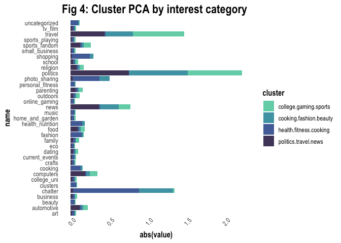<!-- -->

# Grocery Basket Rules Mining

The data file is a list of shopping baskets: one person’s basket for
each row, with multiple items per row separated by commas – you’ll have
to cobble together a few utilities for processing this into the format
expected by the “arules” package. Pick your own thresholds for lift and
confidence; just be clear what these thresholds are and how you picked
them. Do your discovered item sets make sense? Present your discoveries
in an interesting and concise way.

## Data

The data set used in this analysis includes 9,835 grocery baskets for
individuals with each column representing an individual item in each
basket.

## Methodology

In this analysis, we will attempt to find association rules above a
certain threshold of confidence, lift, and support of commonly purchased
items to discern items typically purchased together, rather than find
clusters based on individual customers’ preferences. To do so, we first
cleaned the data and converted each row into a list recognized by the
arules clustering algorithm. Then, the resulting arules were plotted to
visualize the relationship between lift, support, and confidence for our
dataset. In association rule mining, support represents the frequency of
how often a specific item or itemset appears in all baskets. The most
popular or essential items therefore have higher support, such as bread,
milk, and eggs. Furthermore, itemsets with complementary items, such as
bread and butter, will have higher support than itemsets with unrelated
items, such as bread and shampoo. Confidence refers to the likeliness of
occurrence of an item Y given the presence of item X in the basket.
However, the relative frequencies of both item X and Y need to be taken
into account to prevent unrealistically large confidence values. Life
comes into play here, controlling for support of item Y when finding the
conditional probability of item Y given item X. In simple terms, lift
represents the ratio of confidence to the probability of occurrence of
item Y. After converting our basket data into transaction form, we used
the apriori algorithm to prune the association rules using minimum item
thresholds. For our data, we used a minimum support threshold of 0.001,
confidence of 0.5, and a max itemset length of five. Next, we chose a
subset of the rules to further increase our itemset thresholds to 0.001
support, 0.5 confidence, and 10 lift. This resulted in 14 association
rules as discussed below.

## Findings

The selected association rules revealed a few easily identifiable
patterns in consumer shopping behavior. For example, common “essential”
foods such as eggs, vegetables, milk, butter, and cheese are present in
multiple association rules of various configurations, indicating that
baskets containing these items are frequent in occurrence across
shoppers. In addition, a few other relations were found including
between the purchase of liquor and red/blush wine with bottled beer,
indicating that many consumers purchase their alcohol at once at the
grocery store, and between popcorn and soda with salty snacks, showing
there is large occurrence of consumers shopping for events like parties
or other social gatherings. In addition, common meals such as sandwiches
and cake are found in our association rules with ham and cheese
associated with the purchase of white bread, and the baking powder and
flour associated with the purchase of sugar. Overall, we find
significant patterns in the shopping behavior of consumers with
relatively high levels of support, lift, and confidence. Grocery stores
would be smart to take advantage of these patterns to organize their
product shelves - putting soda, popcorn, and chips near eachother for
those shopping for a party, common baking ingredients together for those
baking a cake, and staple items such as milk, eggs, yogurt, vegetables,
and cheese together for the everyday consumer. In addition, stores could
take advantage of these results to create weekly ads and coupons for
combined product purchases, thus increasing sales and revenue by making
it easier for consumers to bundle items frequently purchased together.

    ## transactions as itemMatrix in sparse format with
    ##  9835 rows (elements/itemsets/transactions) and
    ##  169 columns (items) and a density of 0.02609146 
    ## 
    ## most frequent items:
    ##       whole milk other vegetables       rolls/buns             soda 
    ##             2513             1903             1809             1715 
    ##           yogurt          (Other) 
    ##             1372            34055 
    ## 
    ## element (itemset/transaction) length distribution:
    ## sizes
    ##    1    2    3    4    5    6    7    8    9   10   11   12   13   14   15   16 
    ## 2159 1643 1299 1005  855  645  545  438  350  246  182  117   78   77   55   46 
    ##   17   18   19   20   21   22   23   24   26   27   28   29   32 
    ##   29   14   14    9   11    4    6    1    1    1    1    3    1 
    ## 
    ##    Min. 1st Qu.  Median    Mean 3rd Qu.    Max. 
    ##   1.000   2.000   3.000   4.409   6.000  32.000 
    ## 
    ## includes extended item information - examples:
    ##             labels
    ## 1 abrasive cleaner
    ## 2 artif. sweetener
    ## 3   baby cosmetics
    ## 
    ## includes extended transaction information - examples:
    ##   transactionID
    ## 1             1
    ## 2             2
    ## 3             3

    ## Apriori
    ## 
    ## Parameter specification:
    ##  confidence minval smax arem  aval originalSupport maxtime support minlen
    ##         0.5    0.1    1 none FALSE            TRUE       5   0.001      1
    ##  maxlen target  ext
    ##      10  rules TRUE
    ## 
    ## Algorithmic control:
    ##  filter tree heap memopt load sort verbose
    ##     0.1 TRUE TRUE  FALSE TRUE    2    TRUE
    ## 
    ## Absolute minimum support count: 9 
    ## 
    ## set item appearances ...[0 item(s)] done [0.00s].
    ## set transactions ...[169 item(s), 9835 transaction(s)] done [0.01s].
    ## sorting and recoding items ... [157 item(s)] done [0.00s].
    ## creating transaction tree ... done [0.00s].
    ## checking subsets of size 1 2 3 4 5 6 done [0.02s].
    ## writing ... [5668 rule(s)] done [0.00s].
    ## creating S4 object  ... done [0.00s].

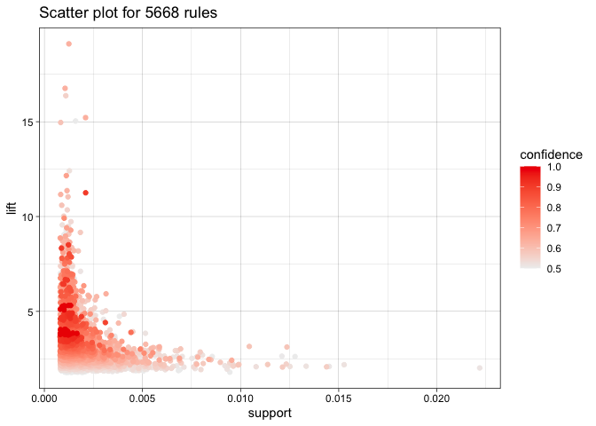<!-- -->

    ##      lhs                         rhs                  support confidence    coverage     lift count
    ## [1]  {liquor,                                                                                      
    ##       red/blush wine}         => {bottled beer}   0.001931876  0.9047619 0.002135231 11.23527    19
    ## [2]  {popcorn,                                                                                     
    ##       soda}                   => {salty snack}    0.001220132  0.6315789 0.001931876 16.69779    12
    ## [3]  {Instant food products,                                                                       
    ##       soda}                   => {hamburger meat} 0.001220132  0.6315789 0.001931876 18.99565    12
    ## [4]  {ham,                                                                                         
    ##       processed cheese}       => {white bread}    0.001931876  0.6333333 0.003050330 15.04549    19
    ## [5]  {domestic eggs,                                                                               
    ##       processed cheese}       => {white bread}    0.001118454  0.5238095 0.002135231 12.44364    11
    ## [6]  {baking powder,                                                                               
    ##       flour}                  => {sugar}          0.001016777  0.5555556 0.001830198 16.40807    10
    ## [7]  {hard cheese,                                                                                 
    ##       whipped/sour cream,                                                                          
    ##       yogurt}                 => {butter}         0.001016777  0.5882353 0.001728521 10.61522    10
    ## [8]  {hamburger meat,                                                                              
    ##       whipped/sour cream,                                                                          
    ##       yogurt}                 => {butter}         0.001016777  0.6250000 0.001626843 11.27867    10
    ## [9]  {sliced cheese,                                                                               
    ##       tropical fruit,                                                                              
    ##       whole milk,                                                                                  
    ##       yogurt}                 => {butter}         0.001016777  0.5555556 0.001830198 10.02548    10
    ## [10] {cream cheese ,                                                                               
    ##       other vegetables,                                                                            
    ##       whipped/sour cream,                                                                          
    ##       yogurt}                 => {curd}           0.001016777  0.5882353 0.001728521 11.04064    10
    ## [11] {curd,                                                                                        
    ##       other vegetables,                                                                            
    ##       whipped/sour cream,                                                                          
    ##       yogurt}                 => {cream cheese }  0.001016777  0.5882353 0.001728521 14.83409    10
    ## [12] {other vegetables,                                                                            
    ##       tropical fruit,                                                                              
    ##       white bread,                                                                                 
    ##       yogurt}                 => {butter}         0.001016777  0.6666667 0.001525165 12.03058    10
    ## [13] {other vegetables,                                                                            
    ##       rolls/buns,                                                                                  
    ##       root vegetables,                                                                             
    ##       tropical fruit,                                                                              
    ##       whole milk}             => {beef}           0.001118454  0.5500000 0.002033554 10.48304    11
    ## [14] {domestic eggs,                                                                               
    ##       other vegetables,                                                                            
    ##       tropical fruit,                                                                              
    ##       whole milk,                                                                                  
    ##       yogurt}                 => {butter}         0.001016777  0.6250000 0.001626843 11.27867    10

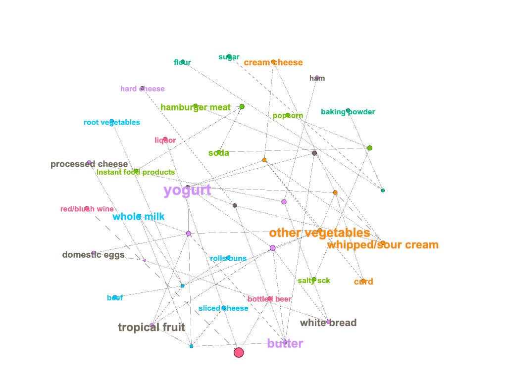<!-- -->
